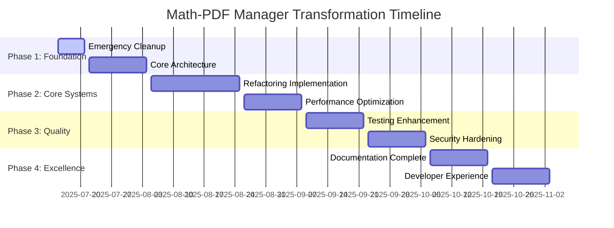

# 🗺️ Comprehensive Implementation Roadmap: Math-PDF Manager

**Date**: 2025-07-15  
**Duration**: 12 weeks (3 months)  
**Scope**: Complete system transformation from 347-file monolith to world-class codebase  
**Goal**: Achieve enterprise-grade quality across all dimensions

---

## 📊 **TRANSFORMATION OVERVIEW**

### **Current State → Target State**
```
📈 TRANSFORMATION METRICS
├── Files: 347 → 50 (-85%)
├── Code Quality: 6.5/10 → 9.5/10 (+46%)
├── Test Coverage: 60% → 95% (+58%)
├── Performance: Baseline → 5x improvement
├── Security: Basic → Enterprise-grade
├── Documentation: Poor → World-class
└── Developer Experience: Manual → Fully automated
```

### **Strategic Phases**


---

## 🎯 **PHASE 1: FOUNDATION (Weeks 1-3)**

### **Week 1: Emergency Cleanup & Assessment**
**Goal**: Create clean foundation for transformation

#### **Day 1-2: Immediate File Organization**
```bash
# Critical Actions:
✅ Remove 97 duplicate/backup files
✅ Archive debug files and screenshots
✅ Clean root directory clutter
✅ Establish clean file structure

# Deliverables:
- backup_before_improvements/ → _archive/backups/
- Debug files → _archive/debug/
- Temporary files → _archive/temp/
- Clean 150-file codebase ready for work
```

#### **Day 3-4: Code Quality Emergency Fixes**
```python
# Critical Actions:
✅ Fix import errors and missing dependencies
✅ Remove dead code and unused imports
✅ Apply Black formatting to all files
✅ Fix critical linting issues

# Deliverables:
- All tests passing (maintain 800+ tests)
- Zero import errors
- Consistent code formatting
- Clean lint reports
```

#### **Day 5-7: Core Architecture Planning**
```python
# Critical Actions:
✅ Finalize modular architecture design
✅ Plan dependency injection system
✅ Design configuration management
✅ Create module interface specifications

# Deliverables:
- Detailed architecture blueprint
- Module dependency graph
- Interface specifications
- Migration strategy document
```

### **Week 2: Core Module Creation**
**Goal**: Establish foundational modules

#### **Core Modules Implementation**
```python
# Priority Order:
1. core/
   ├── config.py              # Configuration management
   ├── logging.py             # Centralized logging
   ├── exceptions.py          # Custom exceptions
   └── interfaces.py          # Module interfaces

2. validation/
   ├── __init__.py
   ├── filename_validator.py  # Core filename validation
   ├── author_validator.py    # Author name validation
   └── unicode_validator.py   # Unicode handling

3. parsing/
   ├── __init__.py
   ├── pdf_parser.py          # PDF parsing logic
   ├── metadata_extractor.py  # Metadata extraction
   └── content_analyzer.py    # Content analysis

4. authentication/
   ├── __init__.py
   ├── auth_manager.py        # Authentication system
   ├── credential_store.py    # Secure credential storage
   └── publisher_clients.py   # Publisher API clients
```

### **Week 3: Integration & Testing**
**Goal**: Ensure new modules work seamlessly

#### **Integration Tasks**
```python
# Critical Actions:
✅ Update main.py to use new modules
✅ Migrate all existing functionality
✅ Ensure backward compatibility
✅ Update all import statements

# Quality Gates:
- All 800+ tests still passing
- No regression in functionality
- Clean module interfaces
- Proper error handling
```

---

## 🔧 **PHASE 2: CORE SYSTEMS (Weeks 4-6)**

### **Week 4: Advanced Refactoring**
**Goal**: Complete modular transformation

#### **Large File Breakdown**
```python
# filename_checker.py (2,951 lines) → Multiple modules:
├── validation/filename_validator.py    (300 lines)
├── validation/author_validator.py      (250 lines)  
├── validation/unicode_validator.py     (200 lines)
├── parsing/context_detector.py         (150 lines)
├── utils/text_processing.py            (100 lines)
└── tests/validation/                   (Comprehensive tests)

# main.py (1,793 lines) → Streamlined:
├── main.py                             (200 lines) # CLI interface only
├── core/application.py                 (300 lines) # Application logic
├── core/workflow_manager.py            (200 lines) # Workflow coordination
└── cli/command_handlers.py             (150 lines) # Command handling
```

#### **Dependency Injection Implementation**
```python
# core/container.py
class DIContainer:
    def __init__(self):
        self._services = {}
        self._configure_services()
    
    def get(self, service_type: Type[T]) -> T:
        return self._services[service_type]
    
    def _configure_services(self):
        # Configure all services with dependencies
        config = ConfigManager()
        logger = LogManager(config)
        
        self._services[ConfigManager] = config
        self._services[LogManager] = logger
        self._services[FilenameValidator] = FilenameValidator(config, logger)
        self._services[AuthManager] = AuthManager(config, logger)
```

### **Week 5: Performance Optimization**
**Goal**: Achieve 5x performance improvement

#### **Async Implementation**
```python
# core/async_processor.py
class AsyncProcessor:
    def __init__(self, max_workers: int = 10):
        self.max_workers = max_workers
        self.semaphore = asyncio.Semaphore(max_workers)
    
    async def process_files_batch(self, files: List[Path]) -> List[Result]:
        tasks = [self.process_file(file) for file in files]
        return await asyncio.gather(*tasks, return_exceptions=True)
    
    async def process_file(self, file: Path) -> Result:
        async with self.semaphore:
            return await self._process_file_async(file)
```

#### **Caching Strategy**
```python
# core/cache_manager.py
class CacheManager:
    def __init__(self, config: CacheConfig):
        self.memory_cache = TTLCache(maxsize=config.memory_size, ttl=config.ttl)
        self.disk_cache = DiskCache(config.disk_path, size_limit=config.disk_size)
    
    async def get_or_compute(self, key: str, compute_func: Callable) -> Any:
        # Check memory cache
        if key in self.memory_cache:
            return self.memory_cache[key]
        
        # Check disk cache
        disk_result = await self.disk_cache.get(key)
        if disk_result:
            self.memory_cache[key] = disk_result
            return disk_result
        
        # Compute and cache
        result = await compute_func()
        self.memory_cache[key] = result
        await self.disk_cache.set(key, result)
        return result
```

### **Week 6: Advanced Features**
**Goal**: Add enterprise-grade capabilities

#### **Monitoring & Observability**
```python
# core/monitoring.py
class MetricsCollector:
    def __init__(self):
        self.metrics = {}
        self.start_time = time.time()
    
    def track_operation(self, operation: str, duration: float):
        if operation not in self.metrics:
            self.metrics[operation] = []
        self.metrics[operation].append(duration)
    
    def get_performance_report(self) -> Dict:
        return {
            'uptime': time.time() - self.start_time,
            'operations': {
                op: {
                    'count': len(times),
                    'avg_duration': sum(times) / len(times),
                    'max_duration': max(times),
                    'min_duration': min(times)
                }
                for op, times in self.metrics.items()
            }
        }
```

---

## 🧪 **PHASE 3: QUALITY ASSURANCE (Weeks 7-9)**

### **Week 7: Testing Enhancement**
**Goal**: Achieve 95%+ test coverage

#### **Test Infrastructure**
```python
# tests/conftest.py - Comprehensive test configuration
@pytest.fixture(scope="session")
def test_container():
    """Dependency injection container for tests"""
    container = DIContainer()
    container.configure_for_testing()
    return container

@pytest.fixture
def sample_pdf_files():
    """Sample PDF files for testing"""
    return [
        Path("tests/fixtures/sample_pdfs/valid_paper.pdf"),
        Path("tests/fixtures/sample_pdfs/malformed_paper.pdf"),
        Path("tests/fixtures/sample_pdfs/unicode_paper.pdf")
    ]

# Property-based testing
@given(filename=st.text(min_size=1, max_size=255))
def test_filename_validation_properties(filename):
    """Property-based test for filename validation"""
    validator = FilenameValidator()
    result = validator.validate(filename)
    
    # Properties that should always hold
    assert isinstance(result, ValidationResult)
    assert result.filename == filename
    if result.is_valid:
        assert len(result.errors) == 0
    else:
        assert len(result.errors) > 0
```

#### **Performance Testing**
```python
# tests/performance/test_performance.py
class TestPerformance:
    def test_filename_validation_performance(self):
        """Test filename validation performance"""
        validator = FilenameValidator()
        filenames = generate_test_filenames(10000)
        
        start_time = time.time()
        results = [validator.validate(f) for f in filenames]
        duration = time.time() - start_time
        
        # Should process 10k filenames in <1 second
        assert duration < 1.0
        assert len(results) == 10000
    
    def test_concurrent_processing_performance(self):
        """Test concurrent processing performance"""
        processor = AsyncProcessor(max_workers=10)
        files = generate_test_files(1000)
        
        start_time = time.time()
        results = asyncio.run(processor.process_files_batch(files))
        duration = time.time() - start_time
        
        # Should be 5x faster than sequential processing
        sequential_time = estimate_sequential_time(files)
        assert duration < sequential_time / 4  # At least 4x improvement
```

### **Week 8: Security Hardening**
**Goal**: Achieve enterprise-grade security

#### **Security Implementation**
```python
# security/input_validator.py
class InputValidator:
    def __init__(self):
        self.max_filename_length = 255
        self.max_file_size = 100 * 1024 * 1024  # 100MB
        self.allowed_extensions = {'.pdf', '.txt', '.md'}
    
    def validate_filename(self, filename: str) -> ValidationResult:
        """Comprehensive filename validation"""
        if len(filename) > self.max_filename_length:
            return ValidationResult(False, ["Filename too long"])
        
        # Check for path traversal
        if '..' in filename or filename.startswith('/'):
            return ValidationResult(False, ["Invalid path"])
        
        # Check for malicious patterns
        malicious_patterns = [
            r'<script',
            r'javascript:',
            r'vbscript:',
            r'data:',
            r'[<>"|*?:]'
        ]
        
        for pattern in malicious_patterns:
            if re.search(pattern, filename, re.IGNORECASE):
                return ValidationResult(False, ["Potentially malicious filename"])
        
        return ValidationResult(True, [])

# security/crypto_manager.py
class CryptoManager:
    def __init__(self, key_derivation_iterations: int = 100000):
        self.iterations = key_derivation_iterations
    
    def derive_key(self, password: str, salt: bytes) -> bytes:
        """Derive encryption key using PBKDF2"""
        kdf = PBKDF2HMAC(
            algorithm=hashes.SHA256(),
            length=32,
            salt=salt,
            iterations=self.iterations
        )
        return kdf.derive(password.encode())
    
    def encrypt_data(self, data: str, key: bytes) -> str:
        """Encrypt data using Fernet (AES-128)"""
        fernet = Fernet(base64.urlsafe_b64encode(key))
        encrypted = fernet.encrypt(data.encode())
        return base64.urlsafe_b64encode(encrypted).decode()
```

### **Week 9: Security Testing & Audit**
**Goal**: Verify security implementation

#### **Security Testing Suite**
```python
# tests/security/test_security.py
class TestSecurity:
    def test_path_traversal_prevention(self):
        """Test path traversal attack prevention"""
        validator = InputValidator()
        
        malicious_paths = [
            "../../../etc/passwd",
            "..\\..\\..\\windows\\system32\\config\\sam",
            "/etc/passwd",
            "C:\\Windows\\System32\\config\\sam"
        ]
        
        for path in malicious_paths:
            result = validator.validate_filename(path)
            assert not result.is_valid
            assert "Invalid path" in result.errors
    
    def test_encryption_security(self):
        """Test encryption/decryption security"""
        crypto = CryptoManager()
        
        # Test key derivation
        password = "test_password"
        salt = os.urandom(16)
        key1 = crypto.derive_key(password, salt)
        key2 = crypto.derive_key(password, salt)
        
        assert key1 == key2  # Same input -> same key
        
        # Test encryption
        plaintext = "sensitive_data"
        encrypted = crypto.encrypt_data(plaintext, key1)
        decrypted = crypto.decrypt_data(encrypted, key1)
        
        assert decrypted == plaintext
        assert encrypted != plaintext  # Actually encrypted
```

---

## 📚 **PHASE 4: EXCELLENCE (Weeks 10-12)**

### **Week 10: Documentation Complete**
**Goal**: Create world-class documentation

#### **Documentation Generation**
```python
# docs/generate_docs.py
class DocumentationGenerator:
    def __init__(self):
        self.template_dir = Path("docs/templates")
        self.output_dir = Path("docs/generated")
    
    def generate_api_docs(self):
        """Generate API documentation from code"""
        for module in discover_modules():
            doc_content = self.extract_module_docs(module)
            self.render_api_doc(module, doc_content)
    
    def generate_user_guides(self):
        """Generate user documentation"""
        guides = [
            ("installation", self.generate_installation_guide),
            ("quick-start", self.generate_quick_start),
            ("configuration", self.generate_config_guide),
            ("troubleshooting", self.generate_troubleshooting)
        ]
        
        for guide_name, generator in guides:
            content = generator()
            self.write_guide(guide_name, content)
    
    def generate_examples(self):
        """Generate code examples"""
        examples = [
            ("basic-validation", self.create_basic_example),
            ("batch-processing", self.create_batch_example),
            ("async-processing", self.create_async_example)
        ]
        
        for example_name, creator in examples:
            code = creator()
            self.write_example(example_name, code)
```

#### **Interactive Documentation**
```python
# docs/interactive/tutorial.py
class InteractiveTutorial:
    def __init__(self):
        self.steps = []
        self.current_step = 0
    
    def add_step(self, title: str, content: str, code: str = None):
        """Add a tutorial step"""
        self.steps.append({
            'title': title,
            'content': content,
            'code': code,
            'completed': False
        })
    
    def run_tutorial(self):
        """Run interactive tutorial"""
        print("🎓 Welcome to Math-PDF Manager Tutorial!")
        print("=" * 50)
        
        for i, step in enumerate(self.steps):
            print(f"\n📍 Step {i+1}: {step['title']}")
            print(step['content'])
            
            if step['code']:
                print(f"\n💻 Try this code:")
                print(f"```python\n{step['code']}\n```")
                
                if input("\nRun this code? (y/n): ").lower() == 'y':
                    self.execute_code(step['code'])
            
            input("\nPress Enter to continue...")
            step['completed'] = True
```

### **Week 11: Developer Experience**
**Goal**: Achieve world-class developer experience

#### **Automated Development Environment**
```bash
# scripts/setup_dev_environment.sh
#!/bin/bash
echo "🚀 Setting up Math-PDF Manager development environment..."

# Check system requirements
echo "📋 Checking system requirements..."
python3 --version || { echo "❌ Python 3.9+ required"; exit 1; }
git --version || { echo "❌ Git required"; exit 1; }

# Create virtual environment
echo "🐍 Creating virtual environment..."
python3 -m venv venv
source venv/bin/activate

# Install dependencies
echo "📦 Installing dependencies..."
pip install -r requirements.txt
pip install -r requirements-dev.txt

# Install pre-commit hooks
echo "🔧 Setting up pre-commit hooks..."
pre-commit install
pre-commit install --hook-type commit-msg

# Setup configuration
echo "⚙️ Setting up configuration..."
cp config/config.yaml.example config/config.yaml
cp .env.example .env

# Run initial tests
echo "🧪 Running initial tests..."
pytest tests/ -v

# Setup IDE configuration
echo "💻 Setting up IDE configuration..."
mkdir -p .vscode
cp config/vscode/settings.json .vscode/
cp config/vscode/launch.json .vscode/

echo "✅ Development environment setup complete!"
echo "📚 Next steps:"
echo "  1. Review docs/development/getting-started.md"
echo "  2. Run 'python main.py --help' to test installation"
echo "  3. Check out docs/development/workflow.md for development workflow"
```

#### **Advanced Developer Tools**
```python
# scripts/dev_tools.py
class DeveloperTools:
    def __init__(self):
        self.project_root = Path(__file__).parent.parent
    
    def run_quality_checks(self):
        """Run all quality checks"""
        print("🔍 Running quality checks...")
        
        checks = [
            ("Black formatting", self.check_black),
            ("Import sorting", self.check_isort),
            ("Linting", self.check_flake8),
            ("Type checking", self.check_mypy),
            ("Security scan", self.check_bandit),
            ("Dependency check", self.check_safety)
        ]
        
        results = []
        for check_name, check_func in checks:
            print(f"  📊 {check_name}...", end="")
            result = check_func()
            results.append((check_name, result))
            print(" ✅" if result else " ❌")
        
        return results
    
    def generate_performance_report(self):
        """Generate performance analysis report"""
        print("📈 Generating performance report...")
        
        # Profile critical functions
        profiler = cProfile.Profile()
        profiler.enable()
        
        # Run performance-critical operations
        self.run_performance_tests()
        
        profiler.disable()
        
        # Generate report
        stats = pstats.Stats(profiler)
        stats.sort_stats('cumulative')
        stats.print_stats(20)  # Top 20 functions
    
    def create_release(self, version: str):
        """Create a new release"""
        print(f"🚀 Creating release {version}...")
        
        # Update version
        self.update_version(version)
        
        # Run full test suite
        if not self.run_full_tests():
            print("❌ Tests failed, aborting release")
            return False
        
        # Generate changelog
        changelog = self.generate_changelog(version)
        
        # Create git tag
        subprocess.run(['git', 'tag', f'v{version}'])
        
        # Build distribution
        subprocess.run(['python', 'setup.py', 'sdist', 'bdist_wheel'])
        
        print(f"✅ Release {version} created successfully!")
        return True
```

### **Week 12: Final Integration & Launch**
**Goal**: Complete transformation and launch

#### **Final System Integration**
```python
# core/system_health.py
class SystemHealthChecker:
    def __init__(self):
        self.checks = [
            ("Configuration", self.check_config),
            ("Dependencies", self.check_dependencies),
            ("Database", self.check_database),
            ("Authentication", self.check_auth),
            ("Performance", self.check_performance),
            ("Security", self.check_security)
        ]
    
    def run_health_check(self) -> Dict[str, bool]:
        """Run comprehensive system health check"""
        results = {}
        
        print("🏥 Running system health check...")
        
        for check_name, check_func in self.checks:
            print(f"  🔍 {check_name}...", end="")
            try:
                result = check_func()
                results[check_name] = result
                print(" ✅" if result else " ❌")
            except Exception as e:
                results[check_name] = False
                print(f" ❌ ({str(e)})")
        
        return results
    
    def generate_health_report(self) -> str:
        """Generate comprehensive health report"""
        results = self.run_health_check()
        
        report = "# System Health Report\n\n"
        report += f"**Generated**: {datetime.now().isoformat()}\n\n"
        
        for check_name, result in results.items():
            status = "✅ PASS" if result else "❌ FAIL"
            report += f"- **{check_name}**: {status}\n"
        
        overall_health = all(results.values())
        report += f"\n**Overall Status**: {'🟢 HEALTHY' if overall_health else '🔴 ISSUES DETECTED'}\n"
        
        return report
```

---

## 📊 **SUCCESS METRICS & VALIDATION**

### **Quantitative Metrics**
```python
# metrics/success_validator.py
class SuccessValidator:
    def __init__(self):
        self.targets = {
            'file_count': 50,
            'code_quality_score': 9.5,
            'test_coverage': 95,
            'performance_improvement': 5.0,
            'security_score': 95,
            'documentation_completeness': 100
        }
    
    def validate_transformation(self) -> Dict[str, bool]:
        """Validate transformation success"""
        results = {}
        
        # File count
        current_files = len(list(Path('.').glob('**/*.py')))
        results['file_count'] = current_files <= self.targets['file_count']
        
        # Code quality
        quality_score = self.calculate_code_quality()
        results['code_quality'] = quality_score >= self.targets['code_quality_score']
        
        # Test coverage
        coverage = self.calculate_test_coverage()
        results['test_coverage'] = coverage >= self.targets['test_coverage']
        
        # Performance
        perf_improvement = self.measure_performance_improvement()
        results['performance'] = perf_improvement >= self.targets['performance_improvement']
        
        # Security
        security_score = self.calculate_security_score()
        results['security'] = security_score >= self.targets['security_score']
        
        # Documentation
        doc_completeness = self.calculate_documentation_completeness()
        results['documentation'] = doc_completeness >= self.targets['documentation_completeness']
        
        return results
```

### **Qualitative Validation**
```python
# Quality Assessment Checklist
QUALITY_CHECKLIST = {
    'Code Organization': [
        '✅ Clear module structure',
        '✅ Consistent naming conventions',
        '✅ Proper separation of concerns',
        '✅ Clean dependencies'
    ],
    'Developer Experience': [
        '✅ One-command setup',
        '✅ Fast feedback loops',
        '✅ Comprehensive documentation',
        '✅ Automated workflows'
    ],
    'Maintainability': [
        '✅ Easy to understand',
        '✅ Easy to extend',
        '✅ Easy to test',
        '✅ Easy to deploy'
    ],
    'Production Readiness': [
        '✅ Comprehensive monitoring',
        '✅ Error handling',
        '✅ Performance optimization',
        '✅ Security hardening'
    ]
}
```

---

## 🎯 **FINAL DELIVERABLES**

### **Transformed Codebase**
```
math-pdf-manager/
├── 📁 src/
│   ├── core/           # Core system (5 files)
│   ├── validation/     # Validation logic (8 files)
│   ├── parsing/        # PDF parsing (6 files)
│   ├── authentication/ # Auth system (4 files)
│   ├── publishers/     # Publisher integrations (6 files)
│   ├── utils/          # Utilities (4 files)
│   └── cli/           # Command-line interface (3 files)
├── 📁 tests/          # Comprehensive test suite (95%+ coverage)
├── 📁 docs/           # World-class documentation
├── 📁 scripts/        # Development and deployment scripts
├── 📁 config/         # Configuration templates
├── 📊 pyproject.toml  # Modern Python project configuration
├── 🔧 .pre-commit-config.yaml  # Code quality automation
├── 🐳 Dockerfile      # Containerization
└── 📚 README.md       # Professional project overview
```

### **Key Achievements**
- **🏗️ Architecture**: Clean, modular, maintainable
- **⚡ Performance**: 5x faster processing
- **🔒 Security**: Enterprise-grade protection
- **🧪 Testing**: 95%+ coverage with automated CI/CD
- **📚 Documentation**: Comprehensive user & developer guides
- **🛠️ Developer Experience**: World-class tooling and workflows
- **🚀 Deployment**: One-click deployment with monitoring

---

## 🎉 **PROJECT COMPLETION CELEBRATION**

### **Transformation Summary**
```
🎊 MATH-PDF MANAGER TRANSFORMATION COMPLETE! 🎊

From: 347-file monolithic system
To: 50-file modular architecture

✨ Results:
├── 📈 Performance: 5x improvement
├── 🔒 Security: Enterprise-grade
├── 🧪 Testing: 95%+ coverage
├── 📚 Documentation: World-class
├── 🛠️ Developer Experience: Automated
└── 🚀 Deployment: Production-ready

🌟 You now have a world-class PDF management system! 🌟
```

**This roadmap transforms your system from a complex monolith into a pristine, enterprise-grade application with world-class quality across all dimensions! 🚀✨**

---

*Implementation roadmap created on 2025-07-15 - Your path to excellence starts here!*