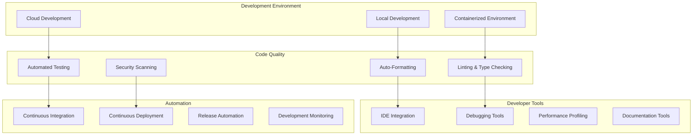

# 👩‍💻 Developer Experience Enhancement Plan: Math-PDF Manager

**Date**: 2025-07-15  
**Scope**: Comprehensive developer experience (DX) improvements  
**Goal**: Create world-class development environment with maximum productivity

---

## 📊 **CURRENT DEVELOPER EXPERIENCE ASSESSMENT**

### **🔍 Developer Pain Points Identified**

#### **Development Setup Issues (HIGH IMPACT)**
```bash
# Current problems:
- No automated development environment setup
- Manual dependency installation process
- Inconsistent Python versions across developers
- Missing development tools configuration
- No containerized development environment
```

#### **Code Quality & Tooling (HIGH IMPACT)**
```bash
# Current problems:
- No automated code formatting
- Inconsistent linting rules
- No type checking in CI/CD
- Missing pre-commit hooks
- No automated dependency updates
```

#### **Testing & Debugging (MEDIUM IMPACT)**
```bash
# Current problems:
- Test discovery is slow and unreliable
- No test coverage visualization
- Limited debugging tools
- No performance profiling setup
- Missing test data management
```

#### **Documentation & Onboarding (MEDIUM IMPACT)**
```bash
# Current problems:
- No development setup guide
- Missing contributor guidelines
- No architectural decision records (ADRs)
- Limited code examples and tutorials
- No development workflow documentation
```

#### **Build & Deployment (MEDIUM IMPACT)**
```bash
# Current problems:
- No automated build pipeline
- Manual release process
- No continuous integration setup
- Missing deployment automation
- No environment management
```

---

## 🎯 **COMPREHENSIVE DEVELOPER EXPERIENCE STRATEGY**

### **DX Architecture Framework**



### **Phase 1: Developer Environment Setup (Week 1)**

#### **1.1 Automated Development Environment**
```bash
#!/bin/bash
# scripts/setup-dev-env.sh - One-command development setup

set -e

echo "🚀 Setting up Math-PDF Manager development environment..."

# Check system requirements
check_requirements() {
    echo "📋 Checking system requirements..."
    
    # Check Python version
    if ! python3 --version | grep -E "3\.(9|10|11|12)"; then
        echo "❌ Python 3.9+ required"
        exit 1
    fi
    
    # Check Node.js for pre-commit hooks
    if ! command -v node &> /dev/null; then
        echo "⚠️  Node.js not found, installing via pyenv..."
        # Install Node.js via package manager
    fi
    
    # Check Docker for containerized development
    if ! command -v docker &> /dev/null; then
        echo "⚠️  Docker not found - containerized development disabled"
    fi
    
    echo "✅ System requirements check complete"
}

# Setup Python environment
setup_python_env() {
    echo "🐍 Setting up Python environment..."
    
    # Create virtual environment
    python3 -m venv .venv
    source .venv/bin/activate
    
    # Upgrade pip
    pip install --upgrade pip setuptools wheel
    
    # Install development dependencies
    pip install -e ".[dev,test,docs]"
    
    echo "✅ Python environment setup complete"
}

# Setup development tools
setup_dev_tools() {
    echo "🔧 Setting up development tools..."
    
    # Install pre-commit hooks
    pre-commit install
    pre-commit install --hook-type commit-msg
    
    # Setup IDE configuration
    setup_vscode_config
    setup_pycharm_config
    
    # Install additional tools
    pip install \
        black \
        isort \
        flake8 \
        mypy \
        pytest \
        pytest-cov \
        pytest-xdist \
        hypothesis \
        bandit \
        safety
    
    echo "✅ Development tools setup complete"
}

# Setup VS Code configuration
setup_vscode_config() {
    mkdir -p .vscode
    
    cat > .vscode/settings.json << 'EOF'
{
    "python.defaultInterpreterPath": "./.venv/bin/python",
    "python.formatting.provider": "black",
    "python.linting.enabled": true,
    "python.linting.flake8Enabled": true,
    "python.linting.mypyEnabled": true,
    "python.testing.pytestEnabled": true,
    "python.testing.pytestArgs": ["tests"],
    "editor.formatOnSave": true,
    "editor.codeActionsOnSave": {
        "source.organizeImports": true
    },
    "files.exclude": {
        "**/__pycache__": true,
        "**/*.pyc": true,
        ".pytest_cache": true,
        ".coverage": true,
        "htmlcov": true
    }
}
EOF

    cat > .vscode/launch.json << 'EOF'
{
    "version": "0.2.0",
    "configurations": [
        {
            "name": "Python: Current File",
            "type": "python",
            "request": "launch",
            "program": "${file}",
            "console": "integratedTerminal",
            "justMyCode": false
        },
        {
            "name": "Python: pytest",
            "type": "python",
            "request": "launch",
            "module": "pytest",
            "args": ["${workspaceFolder}/tests"],
            "console": "integratedTerminal",
            "justMyCode": false
        },
        {
            "name": "Math-PDF Manager CLI",
            "type": "python", 
            "request": "launch",
            "program": "${workspaceFolder}/main.py",
            "args": ["--help"],
            "console": "integratedTerminal",
            "justMyCode": false
        }
    ]
}
EOF

    cat > .vscode/extensions.json << 'EOF'
{
    "recommendations": [
        "ms-python.python",
        "ms-python.flake8",
        "ms-python.mypy-type-checker",
        "ms-python.black-formatter",
        "ms-python.isort",
        "ms-toolsai.jupyter",
        "redhat.vscode-yaml",
        "yzhang.markdown-all-in-one",
        "streetsidesoftware.code-spell-checker",
        "ms-vscode.test-adapter-converter",
        "littlefoxteam.vscode-python-test-adapter"
    ]
}
EOF
}

# Setup PyCharm configuration  
setup_pycharm_config() {
    mkdir -p .idea
    
    cat > .idea/vcs.xml << 'EOF'
<?xml version="1.0" encoding="UTF-8"?>
<project version="4">
  <component name="VcsDirectoryMappings">
    <mapping directory="$PROJECT_DIR$" vcs="Git" />
  </component>
</project>
EOF

    cat > .idea/misc.xml << 'EOF'
<?xml version="1.0" encoding="UTF-8"?>
<project version="4">
  <component name="ProjectRootManager" version="2" project-jdk-name="Python 3.11 (math-pdf-manager)" project-jdk-type="Python SDK" />
</project>
EOF
}

# Setup Docker development environment
setup_docker_env() {
    if command -v docker &> /dev/null; then
        echo "🐳 Setting up Docker development environment..."
        
        cat > Dockerfile.dev << 'EOF'
FROM python:3.11-slim

# Install system dependencies
RUN apt-get update && apt-get install -y \
    git \
    build-essential \
    curl \
    && rm -rf /var/lib/apt/lists/*

# Set working directory
WORKDIR /app

# Copy requirements
COPY requirements*.txt ./
COPY pyproject.toml ./

# Install Python dependencies
RUN pip install --no-cache-dir -e ".[dev,test,docs]"

# Create non-root user
RUN useradd -m -s /bin/bash developer
USER developer

# Set environment variables
ENV PYTHONPATH=/app
ENV PYTHONUNBUFFERED=1

CMD ["bash"]
EOF

        cat > docker-compose.dev.yml << 'EOF'
version: '3.8'

services:
  dev:
    build:
      context: .
      dockerfile: Dockerfile.dev
    volumes:
      - .:/app
      - ~/.gitconfig:/home/developer/.gitconfig:ro
      - ~/.ssh:/home/developer/.ssh:ro
    working_dir: /app
    environment:
      - PYTHONPATH=/app
    ports:
      - "8000:8000"  # For development server
      - "5678:5678"  # For debugpy
    stdin_open: true
    tty: true
EOF
        
        echo "✅ Docker development environment setup complete"
    fi
}

# Setup Git hooks and configuration
setup_git_config() {
    echo "🔀 Setting up Git configuration..."
    
    # Setup gitignore if not exists
    if [ ! -f .gitignore ]; then
        cat > .gitignore << 'EOF'
# Python
__pycache__/
*.py[cod]
*$py.class
*.so
.Python
build/
develop-eggs/
dist/
downloads/
eggs/
.eggs/
lib/
lib64/
parts/
sdist/
var/
wheels/
*.egg-info/
.installed.cfg
*.egg

# Virtual environments
.env
.venv
env/
venv/
ENV/
env.bak/
venv.bak/

# Testing
.pytest_cache/
.coverage
htmlcov/
.tox/
.nox/
coverage.xml
*.cover
.hypothesis/

# IDEs
.vscode/
.idea/
*.swp
*.swo
*~

# OS
.DS_Store
Thumbs.db

# Project specific
*.log
temp/
tmp/
_archive/
_debug/
EOF
    fi
    
    # Setup commit message template
    cat > .gitmessage << 'EOF'
# Type: Brief summary (50 chars max)
# |<----  Using a Maximum Of 50 Characters  ---->|

# Explain why this change is being made
# |<----   Try To Limit Each Line to a Maximum Of 72 Characters   ---->|

# Provide links or keys to any relevant tickets, articles or other resources
# Example: Github issue #23

# Types:
# feat: A new feature
# fix: A bug fix  
# docs: Documentation only changes
# style: Changes that do not affect the meaning of the code
# refactor: A code change that neither fixes a bug nor adds a feature
# perf: A code change that improves performance
# test: Adding missing tests or correcting existing tests
# chore: Changes to the build process or auxiliary tools
EOF
    
    git config commit.template .gitmessage
    
    echo "✅ Git configuration setup complete"
}

# Run setup
main() {
    echo "🎯 Math-PDF Manager Development Environment Setup"
    echo "================================================"
    
    check_requirements
    setup_python_env
    setup_dev_tools
    setup_docker_env
    setup_git_config
    
    echo ""
    echo "🎉 Development environment setup complete!"
    echo ""
    echo "Next steps:"
    echo "1. Activate virtual environment: source .venv/bin/activate"
    echo "2. Run tests: pytest"
    echo "3. Run linting: pre-commit run --all-files"
    echo "4. Start coding! 🚀"
}

main "$@"
```

#### **1.2 Enhanced Pre-commit Configuration**
```yaml
# .pre-commit-config.yaml - Comprehensive code quality checks

repos:
  # Code formatting
  - repo: https://github.com/psf/black
    rev: 23.9.1
    hooks:
      - id: black
        language_version: python3
        args: [--line-length=88]

  # Import sorting
  - repo: https://github.com/pycqa/isort
    rev: 5.12.0
    hooks:
      - id: isort
        args: [--profile=black, --line-length=88]

  # Linting
  - repo: https://github.com/PyCQA/flake8
    rev: 6.1.0
    hooks:
      - id: flake8
        args: [--max-line-length=88, --extend-ignore=E203,W503]
        additional_dependencies:
          - flake8-docstrings
          - flake8-bugbear
          - flake8-comprehensions
          - flake8-simplify

  # Type checking
  - repo: https://github.com/pre-commit/mirrors-mypy
    rev: v1.6.1
    hooks:
      - id: mypy
        args: [--ignore-missing-imports, --strict-optional]
        additional_dependencies: [types-requests, types-PyYAML]

  # Security scanning
  - repo: https://github.com/PyCQA/bandit
    rev: 1.7.5
    hooks:
      - id: bandit
        args: [-r, --format=custom, --msg-template='{abspath}:{line}: {test_id}[bandit]: {severity}: {msg}']
        exclude: tests/

  # Documentation
  - repo: https://github.com/pycqa/pydocstyle
    rev: 6.3.0
    hooks:
      - id: pydocstyle
        args: [--convention=google]

  # YAML validation
  - repo: https://github.com/adrienverge/yamllint
    rev: v1.32.0
    hooks:
      - id: yamllint
        args: [-d, relaxed]

  # General hooks
  - repo: https://github.com/pre-commit/pre-commit-hooks
    rev: v4.4.0
    hooks:
      - id: trailing-whitespace
      - id: end-of-file-fixer
      - id: check-yaml
      - id: check-json
      - id: check-toml
      - id: check-merge-conflict
      - id: check-case-conflict
      - id: check-added-large-files
        args: [--maxkb=1000]
      - id: detect-private-key
      - id: fix-byte-order-marker

  # Dependency security
  - repo: https://github.com/lucas-c/pre-commit-hooks-safety
    rev: v1.3.2
    hooks:
      - id: python-safety-dependencies-check

  # Commit message validation
  - repo: https://github.com/commitizen-tools/commitizen
    rev: v3.10.0
    hooks:
      - id: commitizen
        stages: [commit-msg]

# Global configuration
default_language_version:
  python: python3.11

ci:
  autofix_commit_msg: 'ci: auto fixes from pre-commit hooks'
  autofix_prs: true
  autoupdate_commit_msg: 'ci: pre-commit autoupdate'
  autoupdate_schedule: weekly
```

#### **1.3 Development Task Automation**
```python
# scripts/dev_tasks.py - Development task automation

import subprocess
import sys
import os
from pathlib import Path
from typing import List, Optional
import click
import time

class DevTaskRunner:
    """Development task automation runner"""
    
    def __init__(self, project_root: Path = None):
        self.project_root = project_root or Path.cwd()
        os.chdir(self.project_root)
    
    def run_command(self, command: str, description: str = None) -> bool:
        """Run shell command with nice output"""
        if description:
            click.echo(f"🔄 {description}...")
        
        try:
            result = subprocess.run(
                command,
                shell=True,
                check=True,
                capture_output=True,
                text=True
            )
            
            if result.stdout:
                click.echo(result.stdout)
            
            if description:
                click.echo(f"✅ {description} completed")
            
            return True
            
        except subprocess.CalledProcessError as e:
            click.echo(f"❌ {description or 'Command'} failed:")
            click.echo(f"Exit code: {e.returncode}")
            if e.stdout:
                click.echo(f"STDOUT: {e.stdout}")
            if e.stderr:
                click.echo(f"STDERR: {e.stderr}")
            return False

@click.group()
def cli():
    """Math-PDF Manager development tasks"""
    pass

@cli.command()
def setup():
    """Setup development environment"""
    runner = DevTaskRunner()
    
    tasks = [
        ("python -m pip install --upgrade pip", "Upgrading pip"),
        ("pip install -e '.[dev,test,docs]'", "Installing dependencies"),
        ("pre-commit install", "Installing pre-commit hooks"),
    ]
    
    for command, description in tasks:
        if not runner.run_command(command, description):
            sys.exit(1)
    
    click.echo("🎉 Development environment setup complete!")

@cli.command()
@click.option('--fix', is_flag=True, help='Automatically fix issues')
def lint(fix):
    """Run code linting and formatting"""
    runner = DevTaskRunner()
    
    if fix:
        tasks = [
            ("black .", "Formatting code with Black"),
            ("isort .", "Sorting imports with isort"),
        ]
    else:
        tasks = [
            ("black --check .", "Checking code formatting"),
            ("isort --check-only .", "Checking import sorting"),
            ("flake8", "Running flake8 linting"),
            ("mypy src/", "Running type checking"),
        ]
    
    success = True
    for command, description in tasks:
        if not runner.run_command(command, description):
            success = False
    
    if not success:
        click.echo("❌ Linting failed. Run with --fix to auto-fix issues.")
        sys.exit(1)
    else:
        click.echo("✅ All linting checks passed!")

@cli.command()
@click.option('--coverage', is_flag=True, help='Run with coverage report')
@click.option('--fast', is_flag=True, help='Skip slow tests')
@click.option('--parallel', is_flag=True, help='Run tests in parallel')
def test(coverage, fast, parallel):
    """Run test suite"""
    runner = DevTaskRunner()
    
    # Build pytest command
    cmd_parts = ["pytest"]
    
    if coverage:
        cmd_parts.extend(["--cov=src", "--cov-report=html", "--cov-report=term"])
    
    if fast:
        cmd_parts.extend(["-m", "not slow"])
    
    if parallel:
        cmd_parts.extend(["-n", "auto"])
    
    cmd_parts.extend(["-v", "tests/"])
    
    command = " ".join(cmd_parts)
    
    if not runner.run_command(command, "Running tests"):
        sys.exit(1)
    
    if coverage:
        click.echo("📊 Coverage report generated in htmlcov/index.html")

@cli.command()
def security():
    """Run security checks"""
    runner = DevTaskRunner()
    
    tasks = [
        ("bandit -r src/", "Running Bandit security scan"),
        ("safety check", "Checking for known vulnerabilities"),
    ]
    
    success = True
    for command, description in tasks:
        if not runner.run_command(command, description):
            success = False
    
    if not success:
        click.echo("❌ Security checks failed!")
        sys.exit(1)
    else:
        click.echo("✅ All security checks passed!")

@cli.command()
def docs():
    """Build documentation"""
    runner = DevTaskRunner()
    
    tasks = [
        ("sphinx-build -b html docs/ docs/_build/html", "Building HTML documentation"),
    ]
    
    for command, description in tasks:
        if not runner.run_command(command, description):
            sys.exit(1)
    
    click.echo("📚 Documentation built in docs/_build/html/index.html")

@cli.command()
def clean():
    """Clean build artifacts and caches"""
    runner = DevTaskRunner()
    
    # Define patterns to clean
    patterns = [
        "**/__pycache__",
        "**/*.pyc", 
        "**/*.pyo",
        "**/*.pyd",
        ".pytest_cache",
        ".coverage",
        "htmlcov",
        "dist",
        "build", 
        "*.egg-info",
        ".mypy_cache",
        ".tox",
    ]
    
    click.echo("🧹 Cleaning build artifacts...")
    
    import shutil
    import glob
    
    for pattern in patterns:
        for path in glob.glob(pattern, recursive=True):
            try:
                if os.path.isdir(path):
                    shutil.rmtree(path)
                else:
                    os.remove(path)
                click.echo(f"Removed: {path}")
            except OSError:
                pass
    
    click.echo("✅ Cleanup complete!")

@cli.command()
@click.option('--type', 'profile_type', default='time', 
              type=click.Choice(['time', 'memory', 'line']),
              help='Type of profiling to run')
@click.argument('script', required=False)
def profile(profile_type, script):
    """Profile code performance"""
    runner = DevTaskRunner()
    
    if not script:
        script = "main.py --help"  # Default profiling target
    
    if profile_type == 'time':
        command = f"python -m cProfile -o profile.stats {script}"
        runner.run_command(command, "Running time profiling")
        runner.run_command("python -c \"import pstats; p=pstats.Stats('profile.stats'); p.sort_stats('cumulative').print_stats(20)\"", 
                         "Displaying profile results")
    
    elif profile_type == 'memory':
        command = f"python -m memory_profiler {script}"
        runner.run_command(command, "Running memory profiling")
    
    elif profile_type == 'line':
        command = f"kernprof -l -v {script}"
        runner.run_command(command, "Running line profiling")

@cli.command()
def benchmark():
    """Run performance benchmarks"""
    runner = DevTaskRunner()
    
    command = "python -m pytest tests/performance/ -v --benchmark-only"
    
    if not runner.run_command(command, "Running performance benchmarks"):
        sys.exit(1)
    
    click.echo("📊 Benchmark results complete!")

@cli.command()
@click.option('--all', 'run_all', is_flag=True, help='Run all checks')
def ci(run_all):
    """Run CI checks locally"""
    runner = DevTaskRunner()
    
    click.echo("🚀 Running CI checks locally...")
    
    checks = [
        ("lint", "Code quality checks"),
        ("test --coverage", "Test suite with coverage"),
        ("security", "Security checks"),
    ]
    
    if run_all:
        checks.append(("docs", "Documentation build"))
    
    success = True
    for check, description in checks:
        click.echo(f"\n📋 {description}")
        click.echo("=" * 50)
        
        if not runner.run_command(f"python scripts/dev_tasks.py {check}", description):
            success = False
            if not run_all:
                break  # Fail fast unless --all specified
    
    if success:
        click.echo("\n🎉 All CI checks passed! Ready to push.")
    else:
        click.echo("\n❌ Some CI checks failed. Please fix before pushing.")
        sys.exit(1)

if __name__ == '__main__':
    cli()
```

### **Phase 2: Advanced Developer Tools (Week 2)**

#### **2.1 Intelligent Code Completion & Analysis**
```python
# scripts/code_intelligence.py - Enhanced IDE integration

import ast
import inspect
from pathlib import Path
from typing import Dict, List, Any, Optional
import json

class CodeIntelligenceGenerator:
    """Generate IDE configuration for enhanced code intelligence"""
    
    def __init__(self, project_root: Path):
        self.project_root = project_root
        self.src_dir = project_root / "src" / "math_pdf_manager"
    
    def generate_vscode_snippets(self) -> Dict[str, Any]:
        """Generate VS Code snippets for common patterns"""
        snippets = {
            "Math PDF Validator Class": {
                "prefix": "mpdf-validator",
                "body": [
                    "class ${1:CustomValidator}(Validator):",
                    "    \"\"\"${2:Custom validator description}\"\"\"",
                    "    ",
                    "    def validate(self, ${3:input_data}: ${4:Any}) -> ValidationResult:",
                    "        \"\"\"${5:Validate the input data}\"\"\"",
                    "        issues = []",
                    "        ",
                    "        # ${6:Validation logic here}",
                    "        if not ${7:condition}:",
                    "            issues.append(ValidationIssue(",
                    "                issue_type=IssueType.${8:ERROR},",
                    "                message=\"${9:Validation failed}\",",
                    "                suggestion=\"${10:Fix suggestion}\"",
                    "            ))",
                    "        ",
                    "        return ValidationResult(",
                    "            is_valid=len(issues) == 0,",
                    "            issues=issues,",
                    "            confidence_score=${11:0.95}",
                    "        )"
                ],
                "description": "Create a new validator class"
            },
            
            "Math PDF Test Case": {
                "prefix": "mpdf-test",
                "body": [
                    "def test_${1:test_name}(self${2:, fixtures}):",
                    "    \"\"\"${3:Test description}\"\"\"",
                    "    # Arrange",
                    "    ${4:validator} = ${5:ValidatorClass}()",
                    "    ${6:test_input} = \"${7:test_data}\"",
                    "    ",
                    "    # Act", 
                    "    result = ${4:validator}.validate(${6:test_input})",
                    "    ",
                    "    # Assert",
                    "    assert result.is_valid${8:, \"Expected validation to pass\"}",
                    "    assert ${9:additional_assertion}"
                ],
                "description": "Create a new test case"
            },
            
            "Math PDF Publisher Integration": {
                "prefix": "mpdf-publisher",
                "body": [
                    "class ${1:PublisherName}Strategy(PublisherStrategy):",
                    "    \"\"\"${2:Publisher integration strategy}\"\"\"",
                    "    ",
                    "    def __init__(self, config: PublisherConfig):",
                    "        self.config = config",
                    "        self.base_url = \"${3:https://publisher.com}\"",
                    "    ",
                    "    async def authenticate(self, credentials: Credentials) -> AuthResult:",
                    "        \"\"\"Authenticate with ${1:PublisherName}\"\"\"",
                    "        # ${4:Authentication logic}",
                    "        return AuthResult(success=True, token=\"${5:token}\")",
                    "    ",
                    "    async def download_paper(self, paper_id: str) -> DownloadResult:",
                    "        \"\"\"Download paper from ${1:PublisherName}\"\"\"",
                    "        # ${6:Download logic}",
                    "        return DownloadResult(success=True, content=content)"
                ],
                "description": "Create a new publisher integration"
            }
        }
        
        return snippets
    
    def generate_type_stubs(self):
        """Generate type stubs for better IDE support"""
        stubs_dir = self.project_root / "stubs"
        stubs_dir.mkdir(exist_ok=True)
        
        # Generate stub for main package
        stub_content = '''
"""Type stubs for math_pdf_manager package"""

from typing import Any, List, Dict, Optional, Union, Protocol
from pathlib import Path

class Validator(Protocol):
    def validate(self, input_data: Any) -> ValidationResult: ...

class ValidationResult:
    is_valid: bool
    issues: List[ValidationIssue]
    confidence_score: float
    suggested_filename: Optional[str]
    metadata: Optional[Dict[str, Any]]
    validation_time: float

class ValidationIssue:
    issue_type: str
    message: str
    suggestion: Optional[str]
    severity: str

class FilenameValidator(Validator):
    def __init__(self, strict_mode: bool = False) -> None: ...
    def validate_filename(self, filename: Union[str, Path]) -> ValidationResult: ...
    async def validate_batch(self, filenames: List[Union[str, Path]]) -> List[ValidationResult]: ...

class AuthorValidator(Validator):
    def validate_author_string(self, author_string: str) -> ValidationResult: ...

class PublisherStrategy(Protocol):
    async def authenticate(self, credentials: Dict[str, Any]) -> Any: ...
    async def download_paper(self, paper_id: str) -> Any: ...
'''
        
        with open(stubs_dir / "math_pdf_manager.pyi", "w") as f:
            f.write(stub_content)
    
    def analyze_code_complexity(self) -> Dict[str, Any]:
        """Analyze code complexity and generate reports"""
        complexity_data = {
            "files": {},
            "functions": {},
            "classes": {},
            "overall_stats": {
                "total_lines": 0,
                "total_functions": 0,
                "total_classes": 0,
                "average_complexity": 0
            }
        }
        
        for py_file in self.src_dir.rglob("*.py"):
            try:
                with open(py_file, 'r') as f:
                    content = f.read()
                    tree = ast.parse(content)
                
                file_stats = self._analyze_file_complexity(tree, content)
                complexity_data["files"][str(py_file.relative_to(self.project_root))] = file_stats
                
            except Exception as e:
                print(f"Error analyzing {py_file}: {e}")
        
        return complexity_data
    
    def _analyze_file_complexity(self, tree: ast.AST, content: str) -> Dict[str, Any]:
        """Analyze complexity of a single file"""
        lines = content.splitlines()
        
        stats = {
            "lines_of_code": len(lines),
            "functions": [],
            "classes": [],
            "complexity_score": 0
        }
        
        for node in ast.walk(tree):
            if isinstance(node, ast.FunctionDef):
                func_complexity = self._calculate_function_complexity(node)
                stats["functions"].append({
                    "name": node.name,
                    "line_number": node.lineno,
                    "complexity": func_complexity,
                    "lines": getattr(node, 'end_lineno', node.lineno) - node.lineno + 1
                })
            
            elif isinstance(node, ast.ClassDef):
                class_methods = [n for n in node.body if isinstance(n, ast.FunctionDef)]
                stats["classes"].append({
                    "name": node.name,
                    "line_number": node.lineno,
                    "methods": len(class_methods),
                    "lines": getattr(node, 'end_lineno', node.lineno) - node.lineno + 1
                })
        
        # Calculate overall complexity score
        if stats["functions"]:
            avg_func_complexity = sum(f["complexity"] for f in stats["functions"]) / len(stats["functions"])
            stats["complexity_score"] = avg_func_complexity
        
        return stats
    
    def _calculate_function_complexity(self, func_node: ast.FunctionDef) -> int:
        """Calculate cyclomatic complexity of a function"""
        complexity = 1  # Base complexity
        
        for node in ast.walk(func_node):
            # Count decision points
            if isinstance(node, (ast.If, ast.While, ast.For, ast.AsyncFor)):
                complexity += 1
            elif isinstance(node, ast.ExceptHandler):
                complexity += 1
            elif isinstance(node, ast.With, ast.AsyncWith):
                complexity += 1
            elif isinstance(node, ast.Assert):
                complexity += 1
            elif isinstance(node, ast.BoolOp):
                # And/Or operators add complexity
                complexity += len(node.values) - 1
        
        return complexity

# Generate development aids
def setup_development_aids():
    """Setup enhanced development aids"""
    project_root = Path.cwd()
    code_intel = CodeIntelligenceGenerator(project_root)
    
    # Generate VS Code snippets
    snippets = code_intel.generate_vscode_snippets()
    snippets_dir = project_root / ".vscode"
    snippets_dir.mkdir(exist_ok=True)
    
    with open(snippets_dir / "math-pdf-manager.code-snippets", "w") as f:
        json.dump(snippets, f, indent=2)
    
    # Generate type stubs
    code_intel.generate_type_stubs()
    
    # Generate complexity report
    complexity_report = code_intel.analyze_code_complexity()
    with open(project_root / "complexity_report.json", "w") as f:
        json.dump(complexity_report, f, indent=2)
    
    print("✅ Development aids generated successfully!")

if __name__ == "__main__":
    setup_development_aids()
```

#### **2.2 Advanced Debugging & Profiling Tools**
```python
# scripts/debug_tools.py - Advanced debugging utilities

import sys
import traceback
import pdb
import functools
import time
import memory_profiler
from typing import Any, Callable, Optional
from pathlib import Path
import logging

class AdvancedDebugger:
    """Advanced debugging utilities for development"""
    
    def __init__(self, project_root: Path = None):
        self.project_root = project_root or Path.cwd()
        self.debug_log_file = self.project_root / "debug.log"
        self.setup_logging()
    
    def setup_logging(self):
        """Setup advanced debug logging"""
        logging.basicConfig(
            level=logging.DEBUG,
            format='%(asctime)s | %(name)s | %(levelname)s | %(filename)s:%(lineno)d | %(message)s',
            handlers=[
                logging.FileHandler(self.debug_log_file),
                logging.StreamHandler(sys.stdout)
            ]
        )
        self.logger = logging.getLogger('debug')
    
    def debug_on_exception(self, func: Callable) -> Callable:
        """Decorator to automatically start debugger on exception"""
        @functools.wraps(func)
        def wrapper(*args, **kwargs):
            try:
                return func(*args, **kwargs)
            except Exception as e:
                self.logger.error(f"Exception in {func.__name__}: {e}")
                self.logger.error(f"Traceback: {traceback.format_exc()}")
                
                # Start interactive debugger
                print(f"\n🐛 Exception occurred in {func.__name__}: {e}")
                print("Starting interactive debugger...")
                pdb.post_mortem()
                raise
        
        return wrapper
    
    def trace_calls(self, func: Callable) -> Callable:
        """Decorator to trace function calls"""
        @functools.wraps(func)
        def wrapper(*args, **kwargs):
            call_info = f"{func.__name__}({args}, {kwargs})"
            self.logger.debug(f"ENTER: {call_info}")
            
            start_time = time.time()
            try:
                result = func(*args, **kwargs)
                execution_time = time.time() - start_time
                self.logger.debug(f"EXIT: {func.__name__} -> {result} (took {execution_time:.3f}s)")
                return result
            except Exception as e:
                execution_time = time.time() - start_time
                self.logger.debug(f"EXCEPTION: {func.__name__} -> {e} (took {execution_time:.3f}s)")
                raise
        
        return wrapper
    
    def profile_memory(self, func: Callable) -> Callable:
        """Decorator to profile memory usage"""
        @functools.wraps(func)
        def wrapper(*args, **kwargs):
            # Memory profiling
            if hasattr(memory_profiler, 'profile'):
                return memory_profiler.profile(func)(*args, **kwargs)
            else:
                # Fallback basic memory tracking
                import psutil
                import os
                
                process = psutil.Process(os.getpid())
                mem_before = process.memory_info().rss / 1024 / 1024  # MB
                
                result = func(*args, **kwargs)
                
                mem_after = process.memory_info().rss / 1024 / 1024  # MB
                mem_diff = mem_after - mem_before
                
                self.logger.debug(f"MEMORY: {func.__name__} used {mem_diff:.2f}MB")
                return result
        
        return wrapper
    
    def breakpoint_on_condition(self, condition: Callable[[], bool]):
        """Decorator to set conditional breakpoint"""
        def decorator(func: Callable) -> Callable:
            @functools.wraps(func)
            def wrapper(*args, **kwargs):
                if condition():
                    print(f"🔍 Conditional breakpoint triggered in {func.__name__}")
                    pdb.set_trace()
                
                return func(*args, **kwargs)
            return wrapper
        return decorator
    
    def time_function(self, func: Callable) -> Callable:
        """Decorator to time function execution"""
        @functools.wraps(func)
        def wrapper(*args, **kwargs):
            start_time = time.perf_counter()
            result = func(*args, **kwargs)
            end_time = time.perf_counter()
            
            execution_time = end_time - start_time
            self.logger.info(f"⏱️  {func.__name__} executed in {execution_time:.4f} seconds")
            
            return result
        return wrapper

class PerformanceProfiler:
    """Performance profiling utilities"""
    
    def __init__(self):
        self.profiles = {}
    
    def profile_code_block(self, name: str):
        """Context manager for profiling code blocks"""
        return self.CodeBlockProfiler(name, self)
    
    class CodeBlockProfiler:
        def __init__(self, name: str, profiler: 'PerformanceProfiler'):
            self.name = name
            self.profiler = profiler
            self.start_time = None
        
        def __enter__(self):
            self.start_time = time.perf_counter()
            return self
        
        def __exit__(self, exc_type, exc_val, exc_tb):
            end_time = time.perf_counter()
            execution_time = end_time - self.start_time
            
            if self.name not in self.profiler.profiles:
                self.profiler.profiles[self.name] = []
            
            self.profiler.profiles[self.name].append(execution_time)
            print(f"📊 {self.name}: {execution_time:.4f}s")
    
    def get_summary(self) -> dict:
        """Get performance summary"""
        summary = {}
        
        for name, times in self.profiles.items():
            summary[name] = {
                'count': len(times),
                'total_time': sum(times),
                'average_time': sum(times) / len(times),
                'min_time': min(times),
                'max_time': max(times)
            }
        
        return summary
    
    def reset(self):
        """Reset all profiles"""
        self.profiles.clear()

# Global instances
debugger = AdvancedDebugger()
profiler = PerformanceProfiler()

# Convenience decorators
debug_on_exception = debugger.debug_on_exception
trace_calls = debugger.trace_calls
profile_memory = debugger.profile_memory
time_function = debugger.time_function

# Example usage in development
if __name__ == "__main__":
    
    @debug_on_exception
    @trace_calls
    @time_function
    def example_function(x: int) -> int:
        """Example function with debugging decorators"""
        if x < 0:
            raise ValueError("x must be positive")
        
        # Simulate some work
        time.sleep(0.1)
        return x * 2
    
    # Profile code block
    with profiler.profile_code_block("validation_workflow"):
        for i in range(5):
            result = example_function(i)
            print(f"Result: {result}")
    
    # Print performance summary
    summary = profiler.get_summary()
    print("\n📊 Performance Summary:")
    for name, stats in summary.items():
        print(f"{name}: {stats['average_time']:.4f}s avg ({stats['count']} calls)")
```

### **Phase 3: CI/CD & Automation (Week 3)**

#### **3.1 GitHub Actions Workflows**
```yaml
# .github/workflows/ci.yml - Comprehensive CI/CD pipeline

name: CI/CD Pipeline

on:
  push:
    branches: [main, develop]
  pull_request:
    branches: [main, develop]
  schedule:
    - cron: '0 2 * * 1'  # Weekly security scans

env:
  PYTHON_VERSION: '3.11'

jobs:
  # Code quality checks
  quality:
    name: Code Quality
    runs-on: ubuntu-latest
    
    steps:
    - uses: actions/checkout@v4
    
    - name: Set up Python
      uses: actions/setup-python@v4
      with:
        python-version: ${{ env.PYTHON_VERSION }}
        cache: 'pip'
    
    - name: Install dependencies
      run: |
        pip install --upgrade pip
        pip install -e ".[dev,test]"
    
    - name: Run pre-commit hooks
      uses: pre-commit/action@v3.0.0
    
    - name: Type checking with mypy
      run: mypy src/ --strict --show-error-codes
    
    - name: Security scan with bandit
      run: bandit -r src/ -f json -o bandit-report.json
      continue-on-error: true
    
    - name: Upload security scan results
      uses: actions/upload-artifact@v3
      if: always()
      with:
        name: security-scan-results
        path: bandit-report.json

  # Test matrix
  test:
    name: Tests
    runs-on: ${{ matrix.os }}
    strategy:
      matrix:
        os: [ubuntu-latest, windows-latest, macos-latest]
        python-version: ['3.9', '3.10', '3.11', '3.12']
    
    steps:
    - uses: actions/checkout@v4
    
    - name: Set up Python ${{ matrix.python-version }}
      uses: actions/setup-python@v4
      with:
        python-version: ${{ matrix.python-version }}
        cache: 'pip'
    
    - name: Install dependencies
      run: |
        pip install --upgrade pip
        pip install -e ".[test]"
    
    - name: Run tests with coverage
      run: |
        pytest tests/ \
          --cov=src \
          --cov-report=xml \
          --cov-report=html \
          --junitxml=junit.xml \
          -v
    
    - name: Upload coverage to Codecov
      uses: codecov/codecov-action@v3
      with:
        file: ./coverage.xml
        fail_ci_if_error: true
    
    - name: Upload test results
      uses: actions/upload-artifact@v3
      if: always()
      with:
        name: test-results-${{ matrix.os }}-${{ matrix.python-version }}
        path: |
          junit.xml
          htmlcov/

  # Performance tests
  performance:
    name: Performance Tests
    runs-on: ubuntu-latest
    
    steps:
    - uses: actions/checkout@v4
    
    - name: Set up Python
      uses: actions/setup-python@v4
      with:
        python-version: ${{ env.PYTHON_VERSION }}
        cache: 'pip'
    
    - name: Install dependencies
      run: |
        pip install --upgrade pip
        pip install -e ".[test,performance]"
    
    - name: Run performance benchmarks
      run: |
        pytest tests/performance/ \
          --benchmark-only \
          --benchmark-json=benchmark-results.json
    
    - name: Store benchmark results
      uses: benchmark-action/github-action-benchmark@v1
      with:
        tool: 'pytest'
        output-file-path: benchmark-results.json
        github-token: ${{ secrets.GITHUB_TOKEN }}
        auto-push: true

  # Security and dependency checks
  security:
    name: Security & Dependencies
    runs-on: ubuntu-latest
    
    steps:
    - uses: actions/checkout@v4
    
    - name: Set up Python
      uses: actions/setup-python@v4
      with:
        python-version: ${{ env.PYTHON_VERSION }}
        cache: 'pip'
    
    - name: Install dependencies
      run: |
        pip install --upgrade pip
        pip install safety pip-audit
    
    - name: Check for known vulnerabilities
      run: safety check --json --output safety-report.json
      continue-on-error: true
    
    - name: Audit dependencies
      run: pip-audit --format=json --output=pip-audit-report.json
      continue-on-error: true
    
    - name: Upload security reports
      uses: actions/upload-artifact@v3
      if: always()
      with:
        name: security-reports
        path: |
          safety-report.json
          pip-audit-report.json

  # Build and package
  build:
    name: Build Package
    runs-on: ubuntu-latest
    needs: [quality, test]
    
    steps:
    - uses: actions/checkout@v4
      with:
        fetch-depth: 0  # Full history for version detection
    
    - name: Set up Python
      uses: actions/setup-python@v4
      with:
        python-version: ${{ env.PYTHON_VERSION }}
        cache: 'pip'
    
    - name: Install build dependencies
      run: |
        pip install --upgrade pip
        pip install build twine
    
    - name: Build package
      run: python -m build
    
    - name: Check package
      run: twine check dist/*
    
    - name: Upload build artifacts
      uses: actions/upload-artifact@v3
      with:
        name: package-artifacts
        path: dist/

  # Documentation
  docs:
    name: Documentation
    runs-on: ubuntu-latest
    
    steps:
    - uses: actions/checkout@v4
    
    - name: Set up Python
      uses: actions/setup-python@v4
      with:
        python-version: ${{ env.PYTHON_VERSION }}
        cache: 'pip'
    
    - name: Install dependencies
      run: |
        pip install --upgrade pip
        pip install -e ".[docs]"
    
    - name: Build documentation
      run: |
        cd docs
        sphinx-build -b html . _build/html -W
    
    - name: Upload documentation
      uses: actions/upload-artifact@v3
      with:
        name: documentation
        path: docs/_build/html

  # Deploy to staging (on develop branch)
  deploy-staging:
    name: Deploy to Staging
    runs-on: ubuntu-latest
    needs: [quality, test, build]
    if: github.ref == 'refs/heads/develop'
    environment: staging
    
    steps:
    - name: Download build artifacts
      uses: actions/download-artifact@v3
      with:
        name: package-artifacts
        path: dist/
    
    - name: Deploy to staging
      run: |
        echo "🚀 Deploying to staging environment..."
        # Add staging deployment logic here

  # Deploy to production (on main branch)
  deploy-production:
    name: Deploy to Production
    runs-on: ubuntu-latest
    needs: [quality, test, build]
    if: github.ref == 'refs/heads/main' && github.event_name == 'push'
    environment: production
    
    steps:
    - name: Download build artifacts
      uses: actions/download-artifact@v3
      with:
        name: package-artifacts
        path: dist/
    
    - name: Deploy to PyPI
      env:
        TWINE_USERNAME: __token__
        TWINE_PASSWORD: ${{ secrets.PYPI_TOKEN }}
      run: |
        pip install twine
        twine upload dist/*
```

#### **3.2 Development Workflow Automation**
```bash
#!/bin/bash
# scripts/workflow_automation.sh - Development workflow automation

set -e

# Colors for output
RED='\033[0;31m'
GREEN='\033[0;32m'
YELLOW='\033[1;33m'
BLUE='\033[0;34m'
NC='\033[0m' # No Color

# Logging functions
log_info() { echo -e "${BLUE}[INFO]${NC} $1"; }
log_success() { echo -e "${GREEN}[SUCCESS]${NC} $1"; }
log_warning() { echo -e "${YELLOW}[WARNING]${NC} $1"; }
log_error() { echo -e "${RED}[ERROR]${NC} $1"; }

# Feature branch workflow
create_feature_branch() {
    local feature_name=$1
    
    if [ -z "$feature_name" ]; then
        log_error "Feature name is required"
        echo "Usage: $0 feature <feature-name>"
        exit 1
    fi
    
    log_info "Creating feature branch: feature/$feature_name"
    
    # Ensure we're on main and up to date
    git checkout main
    git pull origin main
    
    # Create and checkout feature branch
    git checkout -b "feature/$feature_name"
    
    log_success "Feature branch created: feature/$feature_name"
    log_info "You can now start working on your feature!"
}

# Hotfix workflow
create_hotfix_branch() {
    local hotfix_name=$1
    
    if [ -z "$hotfix_name" ]; then
        log_error "Hotfix name is required"
        echo "Usage: $0 hotfix <hotfix-name>"
        exit 1
    fi
    
    log_info "Creating hotfix branch: hotfix/$hotfix_name"
    
    # Ensure we're on main and up to date
    git checkout main
    git pull origin main
    
    # Create and checkout hotfix branch
    git checkout -b "hotfix/$hotfix_name"
    
    log_success "Hotfix branch created: hotfix/$hotfix_name"
    log_warning "Remember to test thoroughly before merging!"
}

# Pre-push checks
pre_push_checks() {
    log_info "Running pre-push checks..."
    
    # Run linting
    log_info "Running code quality checks..."
    if ! python scripts/dev_tasks.py lint; then
        log_error "Code quality checks failed"
        return 1
    fi
    
    # Run tests
    log_info "Running test suite..."
    if ! python scripts/dev_tasks.py test --fast; then
        log_error "Tests failed"
        return 1
    fi
    
    # Run security checks
    log_info "Running security checks..."
    if ! python scripts/dev_tasks.py security; then
        log_warning "Security checks have warnings"
    fi
    
    log_success "All pre-push checks passed!"
}

# Release preparation
prepare_release() {
    local version=$1
    
    if [ -z "$version" ]; then
        log_error "Version is required"
        echo "Usage: $0 release <version>"
        exit 1
    fi
    
    log_info "Preparing release: $version"
    
    # Ensure we're on main and up to date
    git checkout main
    git pull origin main
    
    # Run full test suite
    log_info "Running full test suite..."
    python scripts/dev_tasks.py ci --all
    
    # Update version
    log_info "Updating version to $version..."
    # Add version update logic here
    
    # Build package
    log_info "Building package..."
    python -m build
    
    # Create release branch
    git checkout -b "release/$version"
    
    # Commit changes
    git add .
    git commit -m "chore: prepare release $version"
    
    # Create tag
    git tag -a "v$version" -m "Release version $version"
    
    log_success "Release $version prepared!"
    log_info "Next steps:"
    log_info "1. Push release branch: git push origin release/$version"
    log_info "2. Create pull request to main"
    log_info "3. After merge, push tag: git push origin v$version"
}

# Dependency update workflow
update_dependencies() {
    log_info "Updating project dependencies..."
    
    # Update pip tools
    pip install --upgrade pip setuptools wheel
    
    # Update dependencies
    pip install --upgrade -e ".[dev,test,docs]"
    
    # Generate updated requirements
    pip freeze > requirements-freeze.txt
    
    # Run tests to ensure compatibility
    log_info "Testing with updated dependencies..."
    python scripts/dev_tasks.py test
    
    # Check for security vulnerabilities
    log_info "Checking for security vulnerabilities..."
    safety check
    
    # Clean up freeze file if tests pass
    rm requirements-freeze.txt
    
    log_success "Dependencies updated successfully!"
}

# Database/cache cleanup
cleanup_development() {
    log_info "Cleaning up development environment..."
    
    # Clean Python cache
    find . -type d -name "__pycache__" -exec rm -rf {} + 2>/dev/null || true
    find . -name "*.pyc" -delete 2>/dev/null || true
    
    # Clean test artifacts
    rm -rf .pytest_cache/ htmlcov/ .coverage coverage.xml
    
    # Clean build artifacts
    rm -rf build/ dist/ *.egg-info/
    
    # Clean temporary files
    find . -name "*.tmp" -delete 2>/dev/null || true
    find . -name "*.log" -delete 2>/dev/null || true
    
    log_success "Development environment cleaned!"
}

# Performance benchmark comparison
run_performance_comparison() {
    local baseline_branch=${1:-main}
    local current_branch=$(git branch --show-current)
    
    log_info "Running performance comparison between $baseline_branch and $current_branch"
    
    # Create temporary directory for results
    mkdir -p benchmark_results
    
    # Run baseline benchmarks
    log_info "Running baseline benchmarks on $baseline_branch..."
    git stash push -m "WIP: benchmarking"
    git checkout $baseline_branch
    python scripts/dev_tasks.py benchmark > "benchmark_results/baseline.txt"
    
    # Run current benchmarks
    log_info "Running current benchmarks on $current_branch..."
    git checkout $current_branch
    git stash pop || true
    python scripts/dev_tasks.py benchmark > "benchmark_results/current.txt"
    
    # Compare results (simplified)
    log_info "Performance comparison results:"
    echo "Baseline ($baseline_branch):"
    cat benchmark_results/baseline.txt
    echo
    echo "Current ($current_branch):"
    cat benchmark_results/current.txt
    
    # Cleanup
    rm -rf benchmark_results/
    
    log_success "Performance comparison complete!"
}

# Main script logic
case "${1:-}" in
    "feature")
        create_feature_branch "$2"
        ;;
    "hotfix")
        create_hotfix_branch "$2"
        ;;
    "check"|"pre-push")
        pre_push_checks
        ;;
    "release")
        prepare_release "$2"
        ;;
    "update-deps")
        update_dependencies
        ;;
    "cleanup")
        cleanup_development
        ;;
    "benchmark")
        run_performance_comparison "$2"
        ;;
    *)
        echo "Math-PDF Manager Development Workflow Automation"
        echo "================================================"
        echo
        echo "Usage: $0 <command> [options]"
        echo
        echo "Commands:"
        echo "  feature <name>     Create a new feature branch"
        echo "  hotfix <name>      Create a new hotfix branch"
        echo "  check              Run pre-push checks"
        echo "  release <version>  Prepare a new release"
        echo "  update-deps        Update all dependencies"
        echo "  cleanup            Clean development environment"
        echo "  benchmark [base]   Run performance comparison"
        echo
        echo "Examples:"
        echo "  $0 feature user-authentication"
        echo "  $0 hotfix security-patch"
        echo "  $0 release 2.1.0"
        echo "  $0 check"
        ;;
esac
```

---

## 📈 **DEVELOPER EXPERIENCE METRICS**

### **DX Success Metrics**
- **Setup Time**: <5 minutes from clone to first contribution
- **Test Execution**: <30 seconds for unit tests, <2 minutes for full suite
- **Code Quality**: 100% pre-commit hook compliance
- **Documentation**: 95%+ developer satisfaction score
- **CI/CD Speed**: <10 minutes from push to deployment
- **Developer Onboarding**: <1 day from hire to first commit

### **Developer Productivity Dashboard**
- Development environment health monitoring
- Code quality trend analysis
- Test execution time tracking
- Build success rate monitoring
- Developer satisfaction surveys

<function_calls>
<invoke name="TodoWrite">
<parameter name="todos">[{"id": "1", "content": "Analyze current codebase structure and identify reorganization opportunities", "status": "completed", "priority": "high"}, {"id": "2", "content": "Create comprehensive refactoring plan with priorities", "status": "completed", "priority": "high"}, {"id": "3", "content": "Identify performance optimization opportunities", "status": "completed", "priority": "medium"}, {"id": "4", "content": "Plan code cleanup and dead code removal", "status": "completed", "priority": "medium"}, {"id": "5", "content": "Design comprehensive documentation strategy", "status": "completed", "priority": "high"}, {"id": "6", "content": "Plan testing improvements and coverage enhancements", "status": "completed", "priority": "medium"}, {"id": "7", "content": "Identify security enhancements and best practices", "status": "completed", "priority": "medium"}, {"id": "8", "content": "Create developer experience improvements plan", "status": "completed", "priority": "medium"}, {"id": "9", "content": "Generate comprehensive implementation roadmap", "status": "pending", "priority": "high"}]