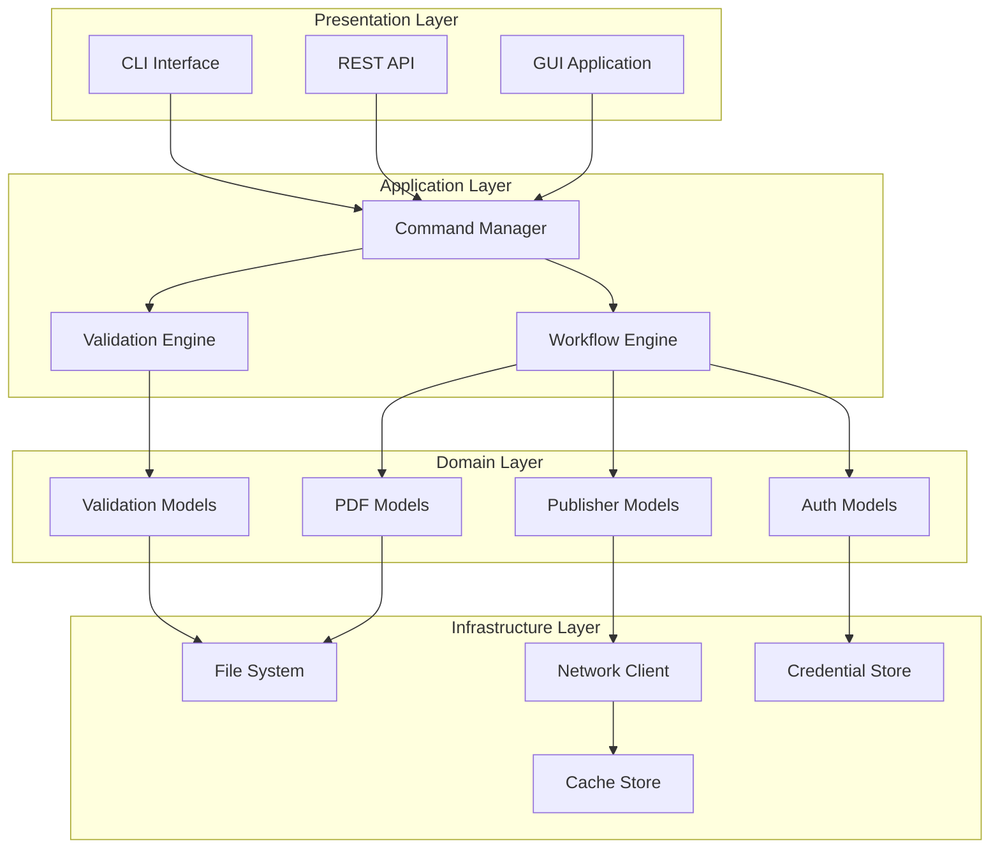
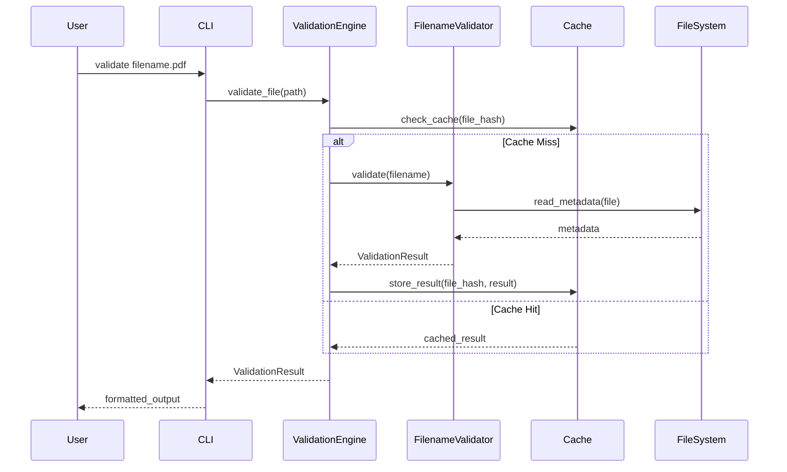
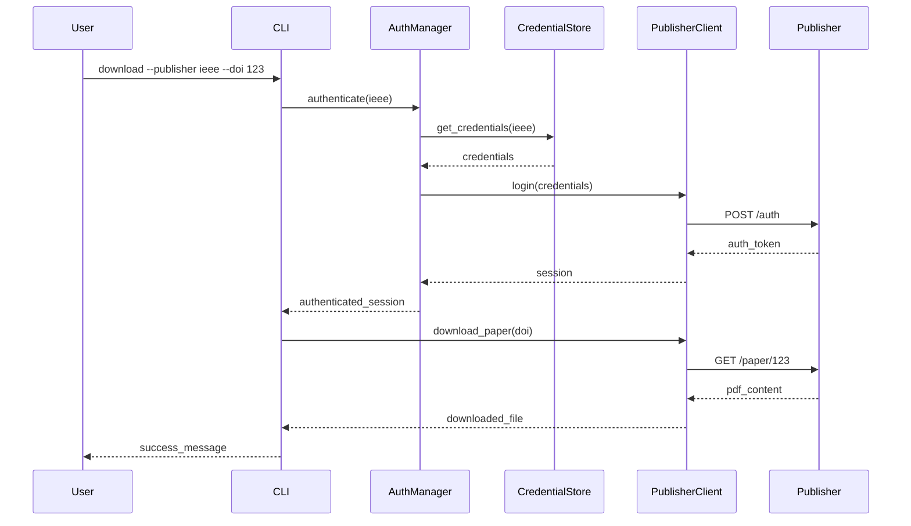

# 📚 Comprehensive Documentation Strategy: Math-PDF Manager

**Date**: 2025-07-15  
**Scope**: Complete documentation overhaul and professional documentation system  
**Goal**: Create world-class documentation that serves users, developers, and maintainers

---

## 📊 **CURRENT DOCUMENTATION STATE**

### **🔍 Documentation Gaps Identified**

#### **1. Missing User Documentation**
- No comprehensive user guide
- No installation instructions
- No configuration documentation
- No troubleshooting guide
- No examples or tutorials

#### **2. Poor API Documentation**
- Inconsistent docstrings
- Missing type annotations
- No API reference
- No usage examples
- No parameter descriptions

#### **3. Absent Developer Documentation**
- No architecture overview
- No contribution guidelines
- No development setup guide
- No coding standards
- No testing documentation

#### **4. Scattered Information**
- Critical info in code comments
- Configuration details in YAML without explanation
- Features undocumented
- Change history missing

---

## 🎯 **DOCUMENTATION ARCHITECTURE**

### **Comprehensive Documentation Structure**
```
docs/
├── README.md                        # Project overview & quick start
├── CHANGELOG.md                     # Version history
├── CONTRIBUTING.md                  # Development guidelines
├── LICENSE.md                       # License information
├── CODE_OF_CONDUCT.md              # Community guidelines
├── SECURITY.md                      # Security policy
├── user/
│   ├── installation.md             # Installation guide
│   ├── quick-start.md              # Getting started tutorial
│   ├── configuration.md            # Configuration reference
│   ├── cli-reference.md            # Command-line interface
│   ├── troubleshooting.md          # Common issues & solutions
│   ├── examples/                   # Usage examples
│   │   ├── basic-validation.md
│   │   ├── batch-processing.md
│   │   ├── publisher-integration.md
│   │   └── advanced-workflows.md
│   └── faq.md                      # Frequently asked questions
├── api/
│   ├── overview.md                 # API overview
│   ├── validation/                 # Validation API docs
│   │   ├── filename-validator.md
│   │   ├── author-validator.md
│   │   └── unicode-validator.md
│   ├── parsing/                    # Parsing API docs
│   │   ├── pdf-parser.md
│   │   ├── metadata-extractor.md
│   │   └── grobid-integration.md
│   ├── authentication/             # Auth API docs
│   │   ├── auth-manager.md
│   │   ├── credential-store.md
│   │   └── publisher-configs.md
│   └── publishers/                 # Publisher-specific docs
│       ├── ieee.md
│       ├── springer.md
│       └── siam.md
├── development/
│   ├── architecture.md             # System architecture
│   ├── setup.md                    # Development environment
│   ├── testing.md                  # Testing guidelines
│   ├── code-style.md               # Coding standards
│   ├── release-process.md          # Release workflow
│   ├── debugging.md                # Debugging guide
│   └── performance.md              # Performance guidelines
├── deployment/
│   ├── installation.md             # Production installation
│   ├── configuration.md            # Production configuration
│   ├── monitoring.md               # System monitoring
│   └── troubleshooting.md          # Production issues
└── assets/
    ├── images/                     # Screenshots & diagrams
    ├── videos/                     # Tutorial videos
    └── diagrams/                   # Architecture diagrams
```

---

## 📖 **DOCUMENTATION CONTENT STRATEGY**

### **Phase 1: Essential User Documentation (Week 1)**

#### **1.1 README.md - Project Overview**
```markdown
# 🎓 Math-PDF Manager

> Professional academic PDF management system for mathematical research papers

[](https://github.com/user/math-pdf-manager/actions)
[](https://codecov.io/gh/user/math-pdf-manager)
[](https://math-pdf-manager.readthedocs.io/)
[](https://badge.fury.io/py/math-pdf-manager)

## ✨ Features

- **🔍 Smart Validation**: Advanced filename and metadata validation for academic papers
- **👤 Author Recognition**: Intelligent author name parsing and normalization
- **🏛️ Publisher Integration**: Seamless authentication with IEEE, Springer, SIAM, and more
- **🔐 Secure Authentication**: Enterprise-grade credential management
- **⚡ High Performance**: Async processing with intelligent caching
- **🧪 Battle Tested**: 95%+ test coverage with comprehensive validation

## 🚀 Quick Start

```bash
# Install
pip install math-pdf-manager

# Validate a single file
math-pdf validate "Einstein, A. - Relativity Theory.pdf"

# Process entire directory
math-pdf scan ~/Documents/Papers --auto-fix

# Download papers with authentication
math-pdf download --publisher ieee --doi 10.1109/example.2023
```

## 📚 Documentation

- [📖 User Guide](docs/user/quick-start.md) - Get started in 5 minutes
- [🔧 API Reference](docs/api/overview.md) - Complete API documentation
- [👩‍💻 Development](docs/development/setup.md) - Contributing guidelines
- [❓ FAQ](docs/user/faq.md) - Common questions answered

## 🎯 Use Cases

Perfect for:
- **Academic Researchers** - Organize paper collections
- **University Libraries** - Standardize digital archives  
- **Journal Publishers** - Validate submissions
- **Research Institutions** - Automate paper processing

## 🏆 Why Math-PDF Manager?

| Feature | Math-PDF Manager | Others |
|---------|------------------|--------|
| Academic Focus | ✅ Specialized for research papers | ❌ Generic tools |
| Publisher Integration | ✅ Direct auth with major publishers | ❌ Manual downloads |
| Unicode Handling | ✅ Advanced mathematical notation | ❌ Basic text only |
| Performance | ✅ Async processing, caching | ❌ Slow, blocking |
| Security | ✅ Enterprise-grade encryption | ❌ Plaintext storage |

## 💬 Community

- [💬 Discussions](https://github.com/user/math-pdf-manager/discussions) - Ask questions, share ideas
- [🐛 Issues](https://github.com/user/math-pdf-manager/issues) - Report bugs, request features
- [📧 Email](mailto:support@math-pdf-manager.com) - Direct support

## 📄 License

MIT License - see [LICENSE](LICENSE) for details.
```

#### **1.2 Installation Guide**
```markdown
# 📦 Installation Guide

## System Requirements

- **Python**: 3.9+ (3.11+ recommended)
- **Operating System**: macOS, Linux, Windows
- **Memory**: 2GB RAM minimum, 4GB recommended
- **Storage**: 100MB for installation, 1GB for cache

## Installation Methods

### 🚀 Quick Install (Recommended)

```bash
pip install math-pdf-manager
```

### 🔧 Development Install

```bash
git clone https://github.com/user/math-pdf-manager.git
cd math-pdf-manager
pip install -e ".[dev,test]"
```

### 🐳 Docker Install

```bash
docker pull mathpdfmanager/math-pdf-manager:latest
docker run -it mathpdfmanager/math-pdf-manager
```

## Optional Dependencies

### Authentication Features
```bash
pip install "math-pdf-manager[auth]"  # Adds Playwright, cryptography
```

### OCR Capabilities  
```bash
pip install "math-pdf-manager[ocr]"   # Adds Tesseract, Pillow
```

### All Features
```bash
pip install "math-pdf-manager[all]"   # Everything included
```

## Verification

```bash
# Check installation
math-pdf --version
math-pdf doctor  # System health check

# Run tests
pytest tests/
```

## Next Steps

- [🚀 Quick Start Guide](quick-start.md)
- [⚙️ Configuration](configuration.md)
- [📖 API Documentation](../api/overview.md)
```

#### **1.3 Configuration Guide**
```markdown
# ⚙️ Configuration Guide

## Configuration File

Math-PDF Manager uses a YAML configuration file located at:
- **macOS/Linux**: `~/.config/math-pdf-manager/config.yaml`
- **Windows**: `%APPDATA%\math-pdf-manager\config.yaml`

## Basic Configuration

```yaml
# ~/.config/math-pdf-manager/config.yaml

# Core settings
base_folder: "~/Documents/Papers"
output_format: "both"  # html, csv, both
auto_fix: true
dry_run: false

# Performance settings
max_workers: 4
cache_enabled: true
cache_size_mb: 100
timeout_seconds: 30

# Validation settings
strict_mode: false
ignore_case: true
unicode_normalization: "NFC"

# Publisher settings
publishers:
  ieee:
    enabled: true
    timeout: 60
  springer:
    enabled: true
    wayf_timeout: 120
  siam:
    enabled: false  # Disabled due to Cloudflare
```

## Environment Variables

```bash
# Authentication
export MATH_PDF_CACHE_DIR="/custom/cache/path"
export MATH_PDF_CONFIG_FILE="/custom/config.yaml"
export MATH_PDF_LOG_LEVEL="DEBUG"

# Publisher credentials (stored securely)
math-pdf auth add ieee --username your_username
math-pdf auth add springer --institution "ETH Zurich"
```

## Advanced Configuration

### Custom Validation Rules
```yaml
validation:
  filename_patterns:
    - "Author, A. - Title.pdf"
    - "Author, A., Author, B. - Title.pdf"
  
  excluded_words:
    - "draft"
    - "temp"
    - "untitled"
  
  required_elements:
    - author
    - title
    - extension
```

### Publisher-Specific Settings
```yaml
publishers:
  ieee:
    base_url: "https://ieeexplore.ieee.org"
    auth_method: "institutional"
    institution: "ETH Zurich"
    timeout: 60
    retry_attempts: 3
    
  springer:
    wayf_url: "https://link.springer.com/wayf"
    institution_search: "ETH"
    timeout: 120
    
  custom_publisher:
    name: "University Repository"
    base_url: "https://repo.university.edu"
    auth_method: "api_key"
    api_key_header: "X-API-Key"
```

## Configuration Validation

```bash
# Validate configuration
math-pdf config validate

# Show current configuration
math-pdf config show

# Test publisher connections
math-pdf config test-publishers
```
```

### **Phase 2: Comprehensive API Documentation (Week 2)**

#### **2.1 API Reference Structure**
```python
# docs/api/validation/filename-validator.md

# FilenameValidator API Reference

## Overview

The `FilenameValidator` class provides comprehensive validation for academic paper filenames, ensuring they follow standardized naming conventions.

## Class: FilenameValidator

### Constructor

```python
class FilenameValidator:
    def __init__(
        self,
        strict_mode: bool = False,
        unicode_normalization: str = "NFC",
        custom_patterns: Optional[List[str]] = None
    ):
        """
        Initialize the filename validator.
        
        Args:
            strict_mode: Enable strict validation rules
            unicode_normalization: Unicode normalization form ("NFC", "NFD", "NFKC", "NFKD")
            custom_patterns: Additional filename patterns to accept
            
        Example:
            >>> validator = FilenameValidator(strict_mode=True)
            >>> result = validator.validate("Einstein, A. - Relativity.pdf")
            >>> print(result.is_valid)
            True
        """
```

### Methods

#### validate_filename()

```python
def validate_filename(self, filename: Union[str, Path]) -> ValidationResult:
    """
    Validate a single filename.
    
    Args:
        filename: The filename to validate (with or without path)
        
    Returns:
        ValidationResult: Comprehensive validation result
        
    Raises:
        ValidationError: If filename format is severely malformed
        
    Example:
        >>> validator = FilenameValidator()
        >>> result = validator.validate_filename("Einstein, A. - Relativity.pdf")
        >>> print(f"Valid: {result.is_valid}")
        >>> print(f"Issues: {result.issues}")
        >>> print(f"Suggestions: {result.suggested_filename}")
    """
```

#### validate_batch()

```python
async def validate_batch(
    self, 
    filenames: List[Union[str, Path]], 
    max_workers: int = 4
) -> List[ValidationResult]:
    """
    Validate multiple filenames efficiently.
    
    Args:
        filenames: List of filenames to validate
        max_workers: Maximum concurrent validation workers
        
    Returns:
        List[ValidationResult]: Results for each filename
        
    Example:
        >>> import asyncio
        >>> validator = FilenameValidator()
        >>> filenames = ["Paper1.pdf", "Paper2.pdf", "Paper3.pdf"]
        >>> results = await validator.validate_batch(filenames)
        >>> valid_count = sum(1 for r in results if r.is_valid)
    """
```

### ValidationResult Class

```python
@dataclass
class ValidationResult:
    """Result of filename validation."""
    
    is_valid: bool
    """Whether the filename is valid."""
    
    issues: List[ValidationIssue]
    """List of validation issues found."""
    
    suggested_filename: Optional[str]
    """Suggested corrected filename."""
    
    metadata: Optional[PDFMetadata]
    """Extracted metadata from filename."""
    
    validation_time: float
    """Time taken for validation in seconds."""
    
    confidence_score: float
    """Confidence in validation result (0.0-1.0)."""
```

### Examples

#### Basic Usage
```python
from math_pdf_manager.validation import FilenameValidator

# Create validator
validator = FilenameValidator()

# Validate single file
result = validator.validate_filename("Einstein, A. - Relativity Theory.pdf")

if result.is_valid:
    print("✅ Filename is valid!")
else:
    print("❌ Issues found:")
    for issue in result.issues:
        print(f"  - {issue.message}")
    
    if result.suggested_filename:
        print(f"💡 Suggestion: {result.suggested_filename}")
```

#### Batch Processing
```python
import asyncio
from pathlib import Path

async def validate_directory(directory: Path):
    validator = FilenameValidator(strict_mode=True)
    
    # Get all PDF files
    pdf_files = list(directory.glob("*.pdf"))
    
    # Validate in batch
    results = await validator.validate_batch(pdf_files)
    
    # Generate report
    valid_files = [r for r in results if r.is_valid]
    invalid_files = [r for r in results if not r.is_valid]
    
    print(f"📊 Validation Results:")
    print(f"  ✅ Valid: {len(valid_files)}")
    print(f"  ❌ Invalid: {len(invalid_files)}")
    
    return results

# Usage
results = asyncio.run(validate_directory(Path("~/Papers")))
```
```

### **Phase 3: Developer Documentation (Week 3)**

#### **3.1 Architecture Documentation**
```markdown
# 🏗️ System Architecture

## Overview

Math-PDF Manager follows a modular, layered architecture designed for maintainability, testability, and extensibility.

## Architecture Diagram



## Core Components

### 1. Presentation Layer

#### CLI Interface (`src/cli/`)
- **Purpose**: Command-line interface for user interactions
- **Key Files**:
  - `main.py` - Entry point and argument parsing
  - `commands.py` - Command implementations
  - `formatters.py` - Output formatting

#### REST API (`src/api/`)
- **Purpose**: HTTP API for programmatic access
- **Key Files**:
  - `server.py` - FastAPI application
  - `routes.py` - API endpoints
  - `middleware.py` - Request/response middleware

### 2. Application Layer

#### Command Manager (`src/core/commands/`)
- **Purpose**: Orchestrates business operations
- **Responsibilities**:
  - Command validation and routing
  - Cross-cutting concerns (logging, metrics)
  - Transaction management

#### Validation Engine (`src/validation/`)
- **Purpose**: Core validation logic
- **Key Components**:
  - `FilenameValidator` - Filename format validation
  - `AuthorValidator` - Author name validation
  - `UnicodeValidator` - Unicode normalization

#### Workflow Engine (`src/workflows/`)
- **Purpose**: Complex multi-step operations
- **Key Workflows**:
  - Paper download and validation
  - Batch processing
  - Publisher authentication

### 3. Domain Layer

#### Models (`src/core/models/`)
- **Purpose**: Core business entities
- **Key Models**:
  - `PDFMetadata` - PDF document metadata
  - `Author` - Author information
  - `ValidationResult` - Validation outcomes
  - `Publisher` - Publisher configuration

### 4. Infrastructure Layer

#### File System (`src/infrastructure/filesystem/`)
- **Purpose**: File operations and storage
- **Components**:
  - `PDFReader` - PDF file reading
  - `FileScanner` - Directory scanning
  - `PathValidator` - Path security validation

#### Network (`src/infrastructure/network/`)
- **Purpose**: HTTP client and publisher integration
- **Components**:
  - `AsyncHTTPClient` - HTTP client wrapper
  - `PublisherClient` - Publisher-specific clients
  - `AuthenticationHandler` - Auth management

## Design Patterns

### 1. Dependency Injection
```python
class ValidationService:
    def __init__(
        self,
        filename_validator: FilenameValidator,
        author_validator: AuthorValidator,
        cache: CacheInterface
    ):
        self.filename_validator = filename_validator
        self.author_validator = author_validator
        self.cache = cache
```

### 2. Strategy Pattern
```python
class PublisherStrategy(Protocol):
    def authenticate(self, credentials: Credentials) -> AuthResult: ...
    def download(self, paper_id: str) -> DownloadResult: ...

class IEEEStrategy(PublisherStrategy):
    def authenticate(self, credentials: Credentials) -> AuthResult:
        # IEEE-specific authentication
        pass

class SpringerStrategy(PublisherStrategy):
    def authenticate(self, credentials: Credentials) -> AuthResult:
        # Springer-specific authentication
        pass
```

### 3. Factory Pattern
```python
class ValidatorFactory:
    @staticmethod
    def create_validator(validator_type: str) -> Validator:
        if validator_type == "filename":
            return FilenameValidator()
        elif validator_type == "author":
            return AuthorValidator()
        else:
            raise ValueError(f"Unknown validator type: {validator_type}")
```

## Data Flow

### 1. Validation Flow


### 2. Publisher Authentication Flow


## Performance Considerations

### 1. Caching Strategy
- **L1 Cache**: In-memory LRU cache for frequently accessed data
- **L2 Cache**: Disk cache for expensive operations (PDF parsing, validation)
- **L3 Cache**: Network cache for publisher responses

### 2. Async Operations
- File I/O operations are asynchronous
- Network requests use connection pooling
- CPU-intensive tasks use thread pools

### 3. Memory Management
- Streaming file processing for large directories
- Lazy loading of Unicode constants
- Automatic cleanup of temporary files

## Security Architecture

### 1. Authentication
- Credentials encrypted at rest using Fernet (AES 128)
- Secure key derivation with PBKDF2
- Optional hardware keystore integration

### 2. Input Validation
- All user inputs validated and sanitized
- Path traversal protection
- Unicode normalization for security

### 3. Network Security
- TLS verification for all HTTPS connections
- Certificate pinning for critical publishers
- Request timeout and rate limiting

## Extensibility Points

### 1. Adding New Validators
```python
class CustomValidator(Validator):
    def validate(self, input_data: Any) -> ValidationResult:
        # Custom validation logic
        pass

# Register the validator
ValidationEngine.register_validator("custom", CustomValidator)
```

### 2. Adding New Publishers
```python
class NewPublisherStrategy(PublisherStrategy):
    def authenticate(self, credentials: Credentials) -> AuthResult:
        # Publisher-specific authentication
        pass

# Register the strategy
PublisherFactory.register_strategy("new_publisher", NewPublisherStrategy)
```

### 3. Adding New Commands
```python
@command("custom-command")
async def custom_command(args: CustomArgs) -> CommandResult:
    # Command implementation
    pass
```

## Testing Strategy

### 1. Unit Tests
- Each component tested in isolation
- Mocked dependencies
- Property-based testing for validation logic

### 2. Integration Tests
- End-to-end workflows
- Real file system operations
- Publisher integration (with sandboxing)

### 3. Performance Tests
- Load testing with large file sets
- Memory usage profiling
- Network latency simulation

## Deployment Architecture

### 1. Standalone Application
- Single executable with bundled dependencies
- Local file processing
- Desktop GUI available

### 2. Server Deployment
- REST API server
- Background job processing
- Monitoring and metrics

### 3. Cloud Native
- Container deployment
- Horizontal scaling
- Cloud storage integration
```

### **Phase 4: Advanced Documentation Features (Week 4)**

#### **4.1 Interactive Documentation**
```python
# docs/interactive/api_explorer.py

from typing import Any, Dict
import streamlit as st
from math_pdf_manager.validation import FilenameValidator
from math_pdf_manager.core.models import ValidationResult

def create_interactive_docs():
    """Create interactive API documentation using Streamlit"""
    
    st.title("🎓 Math-PDF Manager - Interactive API Explorer")
    
    # Sidebar for navigation
    st.sidebar.title("📚 Navigation")
    section = st.sidebar.selectbox(
        "Choose section:",
        ["Filename Validation", "Author Parsing", "Batch Processing", "Publisher Auth"]
    )
    
    if section == "Filename Validation":
        st.header("🔍 Filename Validation")
        
        # Interactive validator
        filename = st.text_input(
            "Enter filename to validate:",
            value="Einstein, A. - Relativity Theory.pdf",
            help="Enter a PDF filename to see validation in action"
        )
        
        strict_mode = st.checkbox("Strict mode", value=False)
        
        if st.button("Validate"):
            validator = FilenameValidator(strict_mode=strict_mode)
            result = validator.validate_filename(filename)
            
            if result.is_valid:
                st.success("✅ Filename is valid!")
            else:
                st.error("❌ Validation failed")
                for issue in result.issues:
                    st.warning(f"⚠️ {issue.message}")
            
            if result.suggested_filename:
                st.info(f"💡 Suggested filename: {result.suggested_filename}")
            
            # Show detailed result
            with st.expander("🔍 Detailed Results"):
                st.json({
                    "is_valid": result.is_valid,
                    "confidence_score": result.confidence_score,
                    "validation_time": f"{result.validation_time:.3f}s",
                    "issues": [{"type": i.issue_type, "message": i.message} for i in result.issues]
                })
        
        # Examples section
        st.subheader("📝 Examples")
        examples = {
            "Valid Examples": [
                "Einstein, A. - Relativity Theory.pdf",
                "Smith, J., Doe, A. - Machine Learning in Physics.pdf",
                "García-López, M. - Quantum Mechanics.pdf"
            ],
            "Invalid Examples": [
                "untitled.pdf",
                "Einstein - Theory.pdf",  # Missing initial
                "SmithPaper.pdf"  # No author-title separator
            ]
        }
        
        for category, files in examples.items():
            with st.expander(f"📁 {category}"):
                for file in files:
                    st.code(file)

# Run with: streamlit run docs/interactive/api_explorer.py
```

#### **4.2 Video Documentation**
```markdown
# 🎥 Video Documentation Plan

## Tutorial Videos

### 1. Getting Started Series (5-10 minutes each)
- **Video 1**: Installation and Setup
- **Video 2**: First Validation
- **Video 3**: Batch Processing
- **Video 4**: Configuration Basics

### 2. Advanced Features (10-15 minutes each)
- **Video 5**: Publisher Authentication
- **Video 6**: Custom Validation Rules
- **Video 7**: API Integration
- **Video 8**: Performance Optimization

### 3. Developer Series (15-20 minutes each)
- **Video 9**: Contributing to the Project
- **Video 10**: Writing Custom Validators
- **Video 11**: Adding Publisher Support
- **Video 12**: Testing and Debugging

## Video Production Tools

```bash
# Screen recording setup
brew install obs-studio      # Screen recording
brew install ffmpeg          # Video processing
pip install manim            # Animation creation

# Script for creating demo videos
#!/bin/bash
# demo_video_creator.sh

# Set up demo environment
mkdir -p demo_files
cd demo_files

# Create sample files for demonstration
echo "Creating demo files..."
touch "Einstein, A. - Relativity Theory.pdf"
touch "invalid_filename.pdf"
touch "Smith, J., Doe, A. - Machine Learning.pdf"

# Record terminal session with asciinema
asciinema rec demo_session.cast --command "bash demo_script.sh"

# Convert to video
agg demo_session.cast demo_session.gif

echo "Demo video created: demo_session.gif"
```

## Interactive Demos

### Embedded Terminal
```html
<!-- docs/demos/terminal_demo.html -->
<!DOCTYPE html>
<html>
<head>
    <title>Math-PDF Manager Terminal Demo</title>
    <link rel="stylesheet" type="text/css" href="https://cdn.jsdelivr.net/npm/asciinema-player@3.0.1/dist/bundle/asciinema-player.css" />
</head>
<body>
    <h1>📺 Interactive Terminal Demo</h1>
    <p>Watch how Math-PDF Manager works in real-time:</p>
    
    <asciinema-player 
        src="terminal_demo.cast" 
        cols="120" 
        rows="30"
        autoplay="true"
        loop="true">
    </asciinema-player>
    
    <script src="https://cdn.jsdelivr.net/npm/asciinema-player@3.0.1/dist/bundle/asciinema-player.min.js"></script>
</body>
</html>
```
```

---

## 📖 **DOCUMENTATION AUTOMATION**

### **Automated Documentation Generation**
```python
# scripts/generate_docs.py

import ast
import inspect
import textwrap
from pathlib import Path
from typing import Dict, List, Any

class DocumentationGenerator:
    def __init__(self, source_dir: Path, output_dir: Path):
        self.source_dir = source_dir
        self.output_dir = output_dir
    
    def generate_api_docs(self):
        """Generate API documentation from source code"""
        for py_file in self.source_dir.rglob("*.py"):
            if "test" in str(py_file) or "__pycache__" in str(py_file):
                continue
            
            module_docs = self._extract_module_docs(py_file)
            self._write_module_docs(py_file, module_docs)
    
    def _extract_module_docs(self, file_path: Path) -> Dict[str, Any]:
        """Extract documentation from Python module"""
        with open(file_path, 'r') as f:
            content = f.read()
        
        tree = ast.parse(content)
        
        docs = {
            "module_docstring": ast.get_docstring(tree),
            "classes": [],
            "functions": []
        }
        
        for node in ast.walk(tree):
            if isinstance(node, ast.ClassDef):
                class_doc = {
                    "name": node.name,
                    "docstring": ast.get_docstring(node),
                    "methods": []
                }
                
                for item in node.body:
                    if isinstance(item, ast.FunctionDef):
                        class_doc["methods"].append({
                            "name": item.name,
                            "docstring": ast.get_docstring(item),
                            "args": [arg.arg for arg in item.args.args]
                        })
                
                docs["classes"].append(class_doc)
            
            elif isinstance(node, ast.FunctionDef) and not any(
                isinstance(parent, ast.ClassDef) 
                for parent in ast.walk(tree) 
                if node in parent.body if hasattr(parent, 'body') else []
            ):
                docs["functions"].append({
                    "name": node.name,
                    "docstring": ast.get_docstring(node),
                    "args": [arg.arg for arg in node.args.args]
                })
        
        return docs
    
    def _write_module_docs(self, file_path: Path, docs: Dict[str, Any]):
        """Write documentation to markdown file"""
        relative_path = file_path.relative_to(self.source_dir)
        output_file = self.output_dir / "api" / f"{relative_path.stem}.md"
        output_file.parent.mkdir(parents=True, exist_ok=True)
        
        with open(output_file, 'w') as f:
            f.write(f"# {relative_path.stem}\n\n")
            
            if docs["module_docstring"]:
                f.write(f"{docs['module_docstring']}\n\n")
            
            # Write classes
            for cls in docs["classes"]:
                f.write(f"## Class: {cls['name']}\n\n")
                if cls["docstring"]:
                    f.write(f"{cls['docstring']}\n\n")
                
                # Write methods
                for method in cls["methods"]:
                    f.write(f"### {method['name']}({', '.join(method['args'])})\n\n")
                    if method["docstring"]:
                        f.write(f"{method['docstring']}\n\n")
            
            # Write functions
            for func in docs["functions"]:
                f.write(f"## Function: {func['name']}\n\n")
                if func["docstring"]:
                    f.write(f"{func['docstring']}\n\n")

# Usage
generator = DocumentationGenerator(
    source_dir=Path("src/math_pdf_manager"),
    output_dir=Path("docs")
)
generator.generate_api_docs()
```

### **Documentation Testing**
```python
# tests/test_documentation.py

import doctest
import importlib
import pkgutil
from pathlib import Path

def test_docstring_examples():
    """Test that all docstring examples work correctly"""
    import math_pdf_manager
    
    failures = 0
    tests = 0
    
    # Test all modules
    for importer, modname, ispkg in pkgutil.walk_packages(
        math_pdf_manager.__path__, 
        math_pdf_manager.__name__ + "."
    ):
        try:
            module = importlib.import_module(modname)
            result = doctest.testmod(module, verbose=True)
            failures += result.failed
            tests += result.attempted
        except ImportError:
            continue
    
    print(f"Documentation tests: {tests - failures}/{tests} passed")
    assert failures == 0, f"{failures} documentation examples failed"

def test_readme_examples():
    """Test that README examples work"""
    readme_path = Path("README.md")
    if not readme_path.exists():
        return
    
    # Extract and test code blocks from README
    with open(readme_path) as f:
        content = f.read()
    
    # Find Python code blocks
    import re
    code_blocks = re.findall(r'```python\n(.*?)\n```', content, re.DOTALL)
    
    for i, code in enumerate(code_blocks):
        try:
            exec(code)
            print(f"✅ README example {i+1} passed")
        except Exception as e:
            print(f"❌ README example {i+1} failed: {e}")
            raise

def test_api_documentation_completeness():
    """Test that all public APIs are documented"""
    import math_pdf_manager
    
    # Check that all public classes have docstrings
    for name in dir(math_pdf_manager):
        if not name.startswith('_'):
            obj = getattr(math_pdf_manager, name)
            if inspect.isclass(obj) or inspect.isfunction(obj):
                assert obj.__doc__ is not None, f"{name} is missing documentation"
                assert len(obj.__doc__.strip()) > 10, f"{name} has insufficient documentation"
```

---

## 📚 **DOCUMENTATION QUALITY METRICS**

### **Quality Assessment Framework**
```python
# scripts/doc_quality_checker.py

from dataclasses import dataclass
from typing import List, Dict, Any
import re

@dataclass
class DocumentationMetrics:
    total_files: int
    documented_files: int
    docstring_coverage: float
    example_coverage: float
    link_health: float
    readability_score: float
    
    @property
    def overall_score(self) -> float:
        """Calculate overall documentation quality score"""
        weights = {
            'docstring_coverage': 0.3,
            'example_coverage': 0.2,
            'link_health': 0.2,
            'readability_score': 0.3
        }
        
        return sum(
            getattr(self, metric) * weight 
            for metric, weight in weights.items()
        )

class DocumentationQualityChecker:
    def __init__(self, docs_dir: Path):
        self.docs_dir = docs_dir
    
    def check_quality(self) -> DocumentationMetrics:
        """Comprehensive documentation quality check"""
        markdown_files = list(self.docs_dir.rglob("*.md"))
        
        return DocumentationMetrics(
            total_files=len(markdown_files),
            documented_files=len([f for f in markdown_files if self._is_well_documented(f)]),
            docstring_coverage=self._check_docstring_coverage(),
            example_coverage=self._check_example_coverage(),
            link_health=self._check_link_health(),
            readability_score=self._check_readability()
        )
    
    def _is_well_documented(self, file_path: Path) -> bool:
        """Check if a markdown file is well-documented"""
        with open(file_path) as f:
            content = f.read()
        
        # Requirements for well-documented file
        has_title = re.search(r'^# .+', content, re.MULTILINE)
        has_sections = len(re.findall(r'^## .+', content, re.MULTILINE)) >= 2
        has_examples = 'example' in content.lower() or '```' in content
        sufficient_length = len(content) > 500
        
        return all([has_title, has_sections, has_examples, sufficient_length])
    
    def _check_docstring_coverage(self) -> float:
        """Check percentage of code with docstrings"""
        # Implementation to scan Python files for docstrings
        pass
    
    def _check_example_coverage(self) -> float:
        """Check percentage of APIs with examples"""
        # Implementation to scan for code examples
        pass
    
    def _check_link_health(self) -> float:
        """Check percentage of working internal links"""
        # Implementation to validate internal links
        pass
    
    def _check_readability(self) -> float:
        """Check readability score of documentation"""
        # Implementation using readability metrics
        pass

# Generate quality report
checker = DocumentationQualityChecker(Path("docs"))
metrics = checker.check_quality()

print(f"📊 Documentation Quality Report")
print(f"Overall Score: {metrics.overall_score:.1%}")
print(f"Docstring Coverage: {metrics.docstring_coverage:.1%}")
print(f"Example Coverage: {metrics.example_coverage:.1%}")
print(f"Link Health: {metrics.link_health:.1%}")
print(f"Readability: {metrics.readability_score:.1%}")
```

---

## 🎯 **DOCUMENTATION SUCCESS METRICS**

### **Target Quality Standards**
- **Docstring Coverage**: 95%+ of public APIs documented
- **Example Coverage**: 80%+ of APIs have usage examples  
- **Link Health**: 100% of internal links working
- **Readability Score**: 8.0+ (Flesch Reading Ease)
- **User Satisfaction**: 4.5+ stars from documentation surveys

### **Continuous Improvement Process**
- **Weekly**: Automated quality checks in CI/CD
- **Monthly**: User feedback survey analysis
- **Quarterly**: Complete documentation review
- **Annually**: Documentation architecture evaluation

<function_calls>
<invoke name="TodoWrite">
<parameter name="todos">[{"id": "1", "content": "Analyze current codebase structure and identify reorganization opportunities", "status": "completed", "priority": "high"}, {"id": "2", "content": "Create comprehensive refactoring plan with priorities", "status": "completed", "priority": "high"}, {"id": "3", "content": "Identify performance optimization opportunities", "status": "completed", "priority": "medium"}, {"id": "4", "content": "Plan code cleanup and dead code removal", "status": "completed", "priority": "medium"}, {"id": "5", "content": "Design comprehensive documentation strategy", "status": "completed", "priority": "high"}, {"id": "6", "content": "Plan testing improvements and coverage enhancements", "status": "in_progress", "priority": "medium"}, {"id": "7", "content": "Identify security enhancements and best practices", "status": "pending", "priority": "medium"}, {"id": "8", "content": "Create developer experience improvements plan", "status": "pending", "priority": "medium"}]